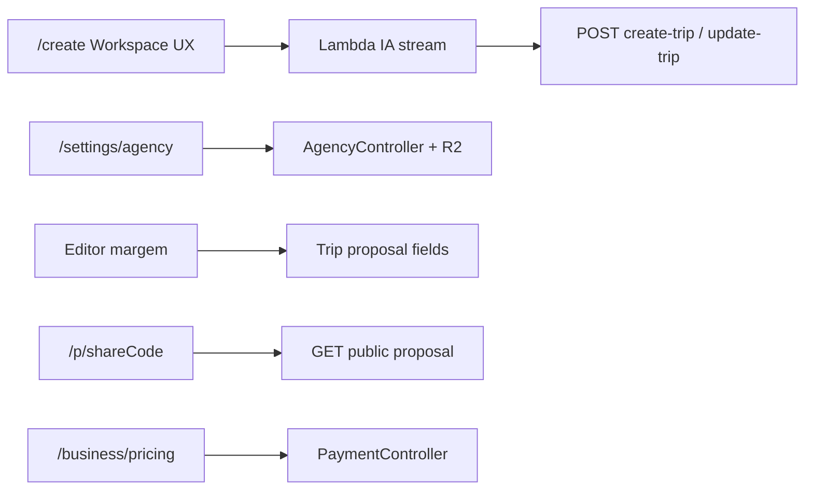

# Baggagi B2B & Core UX — Plano de Execução

Documento de especificação convertido em plano acionável, com **gap analysis** contra o código atual e decisões técnicas fechadas.

## Contexto de repositórios

| Camada | Onde vive | Papel neste plano |
|--------|-----------|-------------------|
| API + Postgres | este repo (`quarkus-app`) | Branding, propostas, Stripe B2B, tenant, auditoria |
| Front Next.js 15 | repo separado (Vercel) | `/create` workspace, `/settings/agency`, `/p/[shareCode]`, Kanban |
| Lambda stream IA | Function URL externa (`NEXT_PUBLIC_PLAN_LAMBDA_STREAM_URL`) | Gemini Flash + `collectLocationInfo` + JSON stream |
| Email worker | [`services/email-worker`](services/email-worker) | SES white-label (Fase 3) |



## Gap analysis (spec vs código)

**Já existe (reusar):**
- [`Agency`](src/main/java/org/example/domain/entity/Agency.java): `name`, `slug`, `logoUrl`, `primaryColor`, `planType`
- [`AgencyMember`](src/main/java/org/example/domain/entity/AgencyMember.java) + papéis `AGENCY_OWNER` / `AGENCY_CONSULTANT`
- [`Trip.agency`](src/main/java/org/example/domain/entity/Trip.java) + filtro B2B em [`TripController`](src/main/java/org/example/controller/TripController.java)
- [`B2bAuditService`](src/main/java/org/example/application/services/B2bAuditService.java) + `b2b_trip_logs`
- R2 via [`ObjectStorageService`](src/main/java/org/example/infrastructure/storage/ObjectStorageService.java) (padrão avatar/documentos)
- Stripe Checkout em [`PaymentController`](src/main/java/org/example/controller/PaymentController.java) com `MENSAL_TRIP_AGENT` / `ANUAL_TRIP_AGENT` → hoje atualiza **Workspace**, não Agency
- Magic Link guest ([`MagicLinkService`](src/main/java/org/example/application/services/MagicLinkService.java)) — fluxo autenticado, **não** é a proposta pública white-label

**Não existe (criar):**
- Colunas `whatsapp_number`, `markup_percentage`, `stripe_subscription_id` em `agencies`
- `proposal_status`, `base_cost`, `final_price`, `share_code` em `trips`
- Modelo de **tiers** / passeios opcionais na proposta
- `AgencyController` (CRUD branding + upload logo)
- API pública da proposta (`GET /api/v1/public/proposals/{shareCode}`, approve)
- Ligação automática `Trip.agency` no create quando o user é membro de agência
- Workspace de espera útil no `/create` (front)
- Gemini 3.5 Flash na Lambda de IA
- Página `/p/[shareCode]` white-label

**Correção à spec original:** Flyway `V3__...` **já está ocupado** (`V3__document_expiry.sql`). Próxima migration = **`V6__b2b_agency_enhancements.sql`**. `logo_url` / `primary_color` já estão no baseline — migration só adiciona o que falta.

---

## Conselho de Críticos (gates de PR)

Toda PR das fases abaixo deve passar pelos três critérios:

- **Letícia:** mobile-first, sem X que aborta stream, CTA WhatsApp óbvio, proposta sem marca Baggagi
- **Valter:** tenant `agency_id` em toda query B2B; timeouts Lambda ≤30s; sem SQS na geração (manter HTTP stream); custo Gemini Flash no free
- **Sarah:** path PLG Stripe claro (Solo R$99 / Team R$299); tempo até 1ª proposta enviável &lt; 15 min; diferencial vs Travefy/Monde

---

## Decisões técnicas fechadas

1. **Geração de roteiro:** manter streaming HTTP client → Lambda (sem job SQS). Cancelar = `AbortController` apenas.
2. **IA:** Gemini 3.5 Flash como modelo default; structured outputs + grounding Places; roteamento Pro/o4-mini só na Fase 4.
3. **Proposta pública:** novo `share_code` opaco (UUID/nanoid) em `trips`, rota front `/p/[shareCode]`, API pública sem auth. Magic Link continua para guests que precisam editar/interagir autenticados.
4. **Billing B2B:** planos Agent passam a gravar `agencies.plan_type` + `stripe_subscription_id` (além ou em substituição do efeito só em Workspace — webhook sincroniza Agency do owner).
5. **Papéis:** mapear spec OWNER/AGENT → enums existentes `AGENCY_OWNER` / `AGENCY_CONSULTANT`.
6. **Markup:** `agencies.markup_percentage` default + override opcional por trip (`base_cost` / `final_price`); slider privado só no editor autenticado — nunca no payload público.
7. **Tiers (Fase 1 mínima):** tabela `trip_proposal_tiers` (`id`, `trip_id`, `code`, `label`, `price_delta`, `sort_order`) + flag `is_optional` em atividades selecionáveis; total recalculado no client da proposta pública.

---

## Fase 1 — Sprint 1 (início imediato)

### 1A. Core UX — Espera Útil (repo Next.js + Lambda IA)

**Problema:** modal com X corta stream e comprime `collectLocationInfo`.

**Solução:** fade-out do formulário `/create` → workspace fullscreen 35%/65%:

| Coluna | Conteúdo |
|--------|----------|
| Esquerda | Feed de chunks do stream (ex.: “Ponte Carlos adicionada ao Dia 1”); botão Cancelar (`AbortController`); sem X |
| Direita | Abas Radix: Visão Geral, Logística, Câmbio, Sobrevivência/Golpes, Dicionário — dados de `collectLocationInfo` |

**Tasks:**
- Front: substituir modal em `app/create` por workspace Framer Motion
- Lambda location: garantir payload rico (câmbio, tips, scams, 5 frases emergência)
- Lambda plan: prompt Gemini 3.5 Flash exigindo horários, dias de abertura, endereço e contato no JSON

*Fora deste repo Quarkus — coordenar PRs nos repos front/Lambda.*

### 1B. Backend — Migration + domínio

Arquivo: [`src/main/resources/db/migration/V6__b2b_agency_enhancements.sql`](src/main/resources/db/migration/V6__b2b_agency_enhancements.sql)

```sql
-- agencies
ALTER TABLE agencies ADD COLUMN IF NOT EXISTS whatsapp_number VARCHAR(32);
ALTER TABLE agencies ADD COLUMN IF NOT EXISTS markup_percentage NUMERIC(5,2) NOT NULL DEFAULT 0;
ALTER TABLE agencies ADD COLUMN IF NOT EXISTS stripe_subscription_id VARCHAR(255);

-- trips
ALTER TABLE trips ADD COLUMN IF NOT EXISTS proposal_status VARCHAR(32) NOT NULL DEFAULT 'DRAFT';
ALTER TABLE trips ADD COLUMN IF NOT EXISTS base_cost NUMERIC(12,2);
ALTER TABLE trips ADD COLUMN IF NOT EXISTS final_price NUMERIC(12,2);
ALTER TABLE trips ADD COLUMN IF NOT EXISTS share_code VARCHAR(64) UNIQUE;

-- tiers
CREATE TABLE trip_proposal_tiers (...);
```

Atualizar entidades [`Agency.java`](src/main/java/org/example/domain/entity/Agency.java), [`Trip.java`](src/main/java/org/example/domain/entity/Trip.java); enum `ProposalStatus` (`DRAFT`, `SENT`, `APPROVED`, `REJECTED`); entity `TripProposalTier`.

**Create trip:** em [`CreateTripUseCaseimpl`](src/main/java/org/example/application/usecases/CreateTripUseCaseimpl.java), se user tem `AgencyMember`, setar `trip.agency` + gerar `share_code`.

### 1C. Backend — Agency branding API

Novo `AgencyController` (`/api/v1/agency`):

| Método | Path | Comportamento |
|--------|------|---------------|
| `GET` | `/me` | Branding da agência do usuário logado |
| `PATCH` | `/me` | `primaryColor`, `whatsappNumber`, `name`, `markupPercentage` |
| `POST` | `/me/logo-upload-request` | Presign R2 key `agencies/{agencyId}/logo-{uuid}.ext` (espelhar avatar) |
| `POST` | `/me/logo-confirm` | Persistir `logoUrl` via `getPublicUrl` |

Auth: membro `AGENCY_OWNER` (PATCH/logo); consultores só GET.

### 1D. Backend — Proposta pública + markup

Novo `PublicProposalController` (`/api/v1/public/proposals`):

| Método | Path | Auth |
|--------|------|------|
| `GET` | `/{shareCode}` | Público — trip + segmentos + tiers + **AgencyBrandingDTO** (logo, cor, whatsapp, nome). Sem markup %, sem logs internos |
| `POST` | `/{shareCode}/approve` | Público — `proposal_status=APPROVED` + audit se agency |

Editor autenticado (extensão Trip API):
- `PATCH /trips/{id}/pricing` — `baseCost` + `markupPercentage` → recalcula `finalPrice`
- `PUT /trips/{id}/tiers` — CRUD tiers
- `POST /trips/{id}/proposal/send` — `SENT` + (opcional) dispara email depois

Ajustar DTOs de resposta de trip para expor `proposalStatus`, `finalPrice`, `shareCode`, `agencyId` ao agente (nunca markup no público).

### 1E. Backend — Stripe B2B self-service

Em [`PaymentController`](src/main/java/org/example/controller/PaymentController.java) / webhook:
- Mapear `MENSAL_TRIP_AGENT` / `ANUAL_TRIP_AGENT` (e novos price IDs Solo R$99 / Team R$299 se distintos) para `Agency.planType` + `stripeSubscriptionId`
- Front `/business/pricing` chama checkout existente

### 1F. Frontend B2B (repo Next.js)

| Rota | Entrega Sprint 1 |
|------|------------------|
| `/settings/agency` | Form branding + preview live Magic/proposta (`--agency-primary-color`) |
| `/p/[shareCode]` | Proposta white-label, tiers/opcionais, CTA WhatsApp + Aprovar |
| Editor trip | Slider markup privado + preview preço cliente |
| `/business/pricing` | Cards Solo/Team → Stripe Checkout |

Types/Zod: `types/b2b.ts`, `lib/validations/b2bSchemas.ts`, hook `useAgencyBranding`.

---

## Fase 2 — CRM & Equipe

- Kanban `/business/pipeline`: colunas mapeadas a `proposal_status` (+ `LOST`); drag-and-drop atualiza status via API; card mostra last-contact (nova coluna `last_contact_at` ou derivado de `b2b_trip_logs`)
- `/settings/team`: listar/invitar `AgencyMember`; OWNER vê tudo, CONSULTANT só próprias trips (já parcialmente no `TripController`)
- API read de auditoria: `GET /agency/audit?tripId=`
- Vouchers: estender [`TripDocument`](src/main/java/org/example/domain/entity/TripDocument.java) com `visibility` (`CLIENT` | `INTERNAL`) + vínculo opcional `activity_id`/`segment_id`; filtro no payload público

## Fase 3 — Comunicação & BI

- email-worker: templates com logo/cor da agência (passar `agencyId` no job; From continua domínio Baggagi até ter domínio custom)
- Gatilhos: proposta enviada, D-7 embarque, pós-venda
- `/business/analytics`: conversão `SENT→APPROVED`, destinos top, `SUM(final_price)` previsto

## Fase 4 — IA Enterprise (backlog)

- Roteamento Gemini Pro / o4-mini para Premium/B2B
- Co-browsing via gateway WS já usado em chat
- OCR passaporte WhatsApp; guardião de voos HITL
- Stripe Connect split (não iniciar antes de Connect onboarding estável)

---

## Checklist Sprint 1 (definição de pronto)

**UX / IA (repos externos)**
- [ ] Workspace fullscreen `/create` com abas guia + Cancelar sem X
- [ ] Lambda plan em Gemini 3.5 Flash com horários/contato obrigatórios no JSON
- [ ] `collectLocationInfo` alimenta câmbio, golpes, dicionário

**Backend (este repo)**
- [ ] `V6__b2b_agency_enhancements.sql` aplicada
- [ ] `AgencyController` branding + logo R2
- [ ] `CreateTrip` associa `agency` + gera `share_code`
- [ ] `PublicProposalController` GET + approve
- [ ] Pricing/markup no editor + tiers mínimos
- [ ] Webhook Stripe sincroniza `Agency.planType`

**Frontend (repo Next.js)**
- [ ] `/settings/agency` com preview
- [ ] `/p/[shareCode]` white-label + WhatsApp + Aprovar
- [ ] Slider markup no editor
- [ ] `/business/pricing` → Checkout

**Gates personas:** Letícia (mobile proposta), Valter (isolamento tenant + sem SQS), Sarah (checkout PLG funcional).

---

## Ordem de implementação recomendada (este repo)

1. Migration V6 + entidades/enums
2. `CreateTrip` liga agency + `share_code`
3. `AgencyController` + upload logo
4. Public proposal GET/approve + DTOs branding
5. Pricing/tiers endpoints + audit actions
6. Ajuste webhook Stripe → Agency
7. Testes de isolamento tenant (OWNER vs CONSULTANT vs público)

Paralelo: front workspace `/create` + Gemini na Lambda (não bloqueiam API branding, mas bloqueiam “encantamento” B2C).
