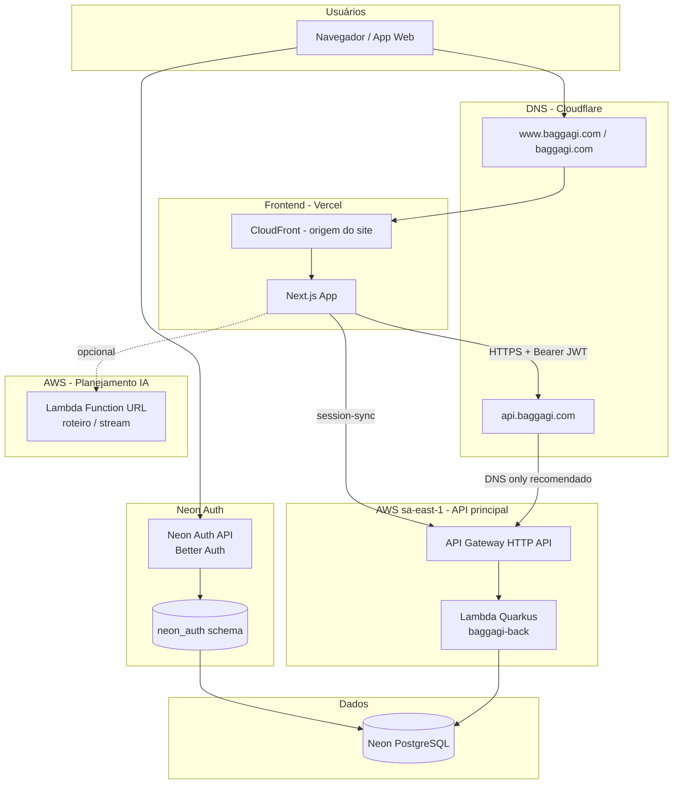
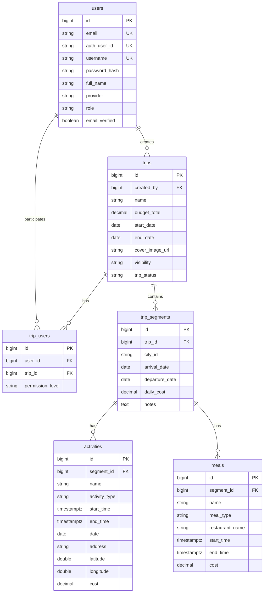
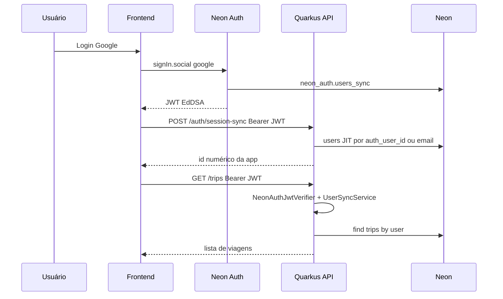

# Arquitetura completa — Baggagi (Quarkus App)

Documentação de referência do produto **planejamento de viagens**: frontend, backend, autenticação **Neon Auth**, infraestrutura AWS, DNS, banco de dados e integrações.

Documentos relacionados:

| Arquivo | Conteúdo |
|---------|----------|
| [DEPLOY.md](DEPLOY.md) | Deploy SAM/Lambda, erros comuns (CORS, Neon, SnapStart) |
| [DOCUMENTACAO.md](DOCUMENTACAO.md) | Detalhes de código, DTOs e desenvolvimento local |
| [EXEMPLO_USO.md](EXEMPLO_USO.md) | Exemplo de payload completo de viagem |
| [scripts/neon-schema-auth.sql](scripts/neon-schema-auth.sql) | SQL manual para coluna `auth_user_id` no Neon |

---

## 1. Visão do produto

O **Baggagi** permite que usuários:

- Autentiquem via **Neon Auth** (Google OAuth, e-mail, etc.) integrado ao Postgres Neon.
- Criem e editem **viagens** com orçamento, datas, imagem de capa e visibilidade.
- Organizem o roteiro em **segmentos** (cidades/períodos), com **atividades** e **refeições** (horários, endereço, coordenadas, custos).
- Compartilhem viagens com outros usuários via **`trip_users`** e níveis de permissão (`OWNER`, `ADMIN`, etc.).
- (Frontend) Podem usar um serviço separado de **geração de roteiro por IA** via Lambda Function URL.

Este repositório (`quarkus-app`) é o **backend principal** (API REST + persistência PostgreSQL).

---

## 2. Arquitetura de ponta a ponta



### 2.1 Camadas de rede e segurança

| Camada | Componente | Função | Configuração atual |
|--------|------------|--------|-------------------|
| DNS | **Cloudflare** | Resolve domínios públicos | `baggagi.com`, `www` → CloudFront; `api` → API Gateway |
| CDN / Site | **CloudFront** | Entrega estática/SSR do frontend | Registros **DNS only** (nuvem cinza) |
| API | **Cloudflare** (opcional) | Proxy/WAF/CDN na API | Recomendado: **DNS only** em `api` para evitar 403/CORS extras |
| WAF | Cloudflare (se Proxied) ou AWS WAF | Filtragem | Com **DNS only** na API, WAF da Cloudflare não intercepta tráfego da API |
| API edge | **API Gateway HTTP API** | Roteamento HTTPS → Lambda | CORS configurado no template SAM + Quarkus |
| Compute | **Lambda Java 21** | Quarkus + SnapStart | Stack `baggagi-back`, alias `live` |
| Auth | **Neon Auth** | Login, JWT EdDSA, `neon_auth` schema | JWKS validado pelo backend (`NeonAuthJwtVerifier`) |
| DB | **Neon** | PostgreSQL serverless | Pooler `*.neon.tech`, SSL obrigatório |

### 2.2 URLs de produção (referência)

| Serviço | URL |
|---------|-----|
| Site | `https://baggagi.com`, `https://www.baggagi.com` |
| API backend | `https://api.baggagi.com` |
| Neon Auth | URL do projeto no console Neon → Auth (`NEON_AUTH_BASE_URL`) |
| Lambda IA (frontend) | `NEXT_PUBLIC_PLAN_LAMBDA_STREAM_URL` (Function URL separada, região `sa-east-1`) |

---

## 3. Frontend (repositório separado — Vercel)

O frontend **não está neste repositório**. Em produção costuma ser **Next.js** na **Vercel**, com variáveis como:

| Variável | Exemplo | Uso |
|----------|---------|-----|
| `NEXT_PUBLIC_API_URL` | `https://api.baggagi.com` | Chamadas REST ao Quarkus |
| `NEXT_PUBLIC_APP_URL` | `https://baggagi.com` | Links e redirects |
| `NEXT_PUBLIC_MAPBOX_ACCESS_TOKEN` | (token Mapbox) | Mapas no roteiro |
| `NEXT_PUBLIC_PLAN_LAMBDA_STREAM_URL` | `https://....lambda-url.sa-east-1.on.aws/` | Geração/stream de planejamento (Lambda **fora** deste projeto) |

### 3.1 Fluxo típico no browser

1. Usuário faz login com **Neon Auth** (ex.: Google) → recebe **JWT** (`authClient.token()`).
2. Front chama `POST /api/v1/auth/session-sync` e depois `https://api.baggagi.com` com `Authorization: Bearer <jwt>`.
3. Salva/atualiza viagem via `POST/PUT` em `/api/v1/trips/...`.
4. Opcionalmente chama a **Lambda de planejamento** para montar roteiro antes de persistir.

### 3.2 CORS

O backend aceita origens configuradas em `QUARKUS_HTTP_CORS_ORIGINS` (Lambda) / `quarkus.http.cors.origins` (local), incluindo `https://baggagi.com` e `http://localhost:3000`. Sem isso, o browser retorna **403** em requisições com header `Origin`.

---

## 4. Backend — AWS Lambda (Quarkus)

### 4.1 Stack e deploy

| Item | Valor |
|------|--------|
| Ferramenta | AWS SAM (`target/sam.jvm.yaml` gerado no `mvn package`) |
| Stack CloudFormation | `baggagi-back` (exemplo) |
| Handler | `io.quarkus.amazon.lambda.runtime.QuarkusStreamHandler` |
| Runtime | Java 21 |
| Memória / timeout | 1024 MB / 30 s |
| SnapStart | Habilitado (`ApplyOn: PublishedVersions`) |
| Perfil Quarkus | `QUARKUS_PROFILE=lambda` |

**Build e deploy:**

```bash
mvn package -DskipTests
sam deploy -t target/sam.jvm.yaml --parameter-overrides DbPassword="SENHA_NEON"
```

### 4.2 Variáveis de ambiente na Lambda (API)

| Variável | Obrigatória | Descrição |
|----------|-------------|-----------|
| `QUARKUS_PROFILE` | Sim | `lambda` — ativa `application-lambda.properties` |
| `QUARKUS_DATASOURCE_PASSWORD` | Sim | Senha Neon (`neondb_owner`) |
| `QUARKUS_DATASOURCE_JDBC_URL` | Não | Override da JDBC URL |
| `QUARKUS_HTTP_CORS_ORIGINS` | Recomendado | Lista de origens do frontend |
| `NEON_AUTH_BASE_URL` | Sim | URL base do Neon Auth (JWKS + issuer) |
| `JAVA_TOOL_OPTIONS` | Sim | `-Djava.net.preferIPv4Stack=true` |

**Requisito de rede:** Lambda **sem VPC** (ou VPC com NAT) para alcançar Neon e JWKS do Neon Auth na internet.

### 4.3 Perfil `lambda` vs desenvolvimento local

| Config | Local (`application.properties`) | Lambda (`application-lambda.properties`) |
|--------|-----------------------------------|----------------------------------------|
| Hibernate DDL | `database.generation=update` | `none` |
| Schema | Hibernate cria/altera tabelas | **Flyway** `migrate-at-start=true` |
| MongoDB | Configurado (dev) | `quarkus.mongodb.enabled=false` |
| SQL log | `true` | `false` |

Migrações Flyway: `V1__...`, `V7__neon_auth_user_id.sql` (coluna `auth_user_id`), etc.

---

## 5. Autenticação e identidade

### 5.1 Neon Auth

- Serviço gerenciado no **mesmo projeto Neon** (schema `neon_auth`, tabela `users_sync`).
- **JWT:** EdDSA (Ed25519), validado por `NeonAuthJwtVerifier` via `{NEON_AUTH_BASE_URL}/.well-known/jwks.json`.
- Claims principais: `sub`, `id` (UUID), `email`, `name`, `image`.
- Google OAuth: configurar no console Neon → Auth → OAuth (pode reutilizar o OAuth Client do Google Cloud usado antes).

### 5.2 Vínculo Neon Auth ↔ `users` (aplicação)

| Campo | Descrição |
|-------|-----------|
| `users.auth_user_id` | UUID do Neon Auth (`sub` do JWT) |
| `users.id` | PK numérica da aplicação (viagens, permissões) |
| `users.provider` | `google`, `neon`, etc. |

`UserSyncService` resolve por `auth_user_id`, depois por e-mail (mesma conta Google migrada), depois cria usuário.

### 5.3 Validação do token nas rotas protegidas

`TokenServiceImpl.validateToken()`:

1. **Neon Auth JWT** → `NeonAuthJwtVerifier` + JIT → retorna `users.id` como string.
2. **JWT legado** (login e-mail/senha local) → claim `userId` numérico.

### 5.4 Endpoints de autenticação

| Endpoint | Auth | Descrição |
|----------|------|-----------|
| `POST /api/v1/auth/session-sync` | Bearer Neon Auth JWT | Cria/vincula usuário em `users` |
| `GET /api/v1/auth/me` | Bearer JWT | Perfil do usuário autenticado |
| `POST /api/v1/users/login` | Não | Legado e-mail/senha (BCrypt + JWT local RS256) |
| `POST /api/v1/users/create-user` | Não | Registro legado |

---

## 6. Arquitetura de software (backend Java)

Padrão em camadas (clean-ish):

```text
org.example
├── controller/          # REST (JAX-RS)
├── application/
│   ├── dto/             # Request/Response
│   ├── usecases/        # Casos de uso
│   └── services/        # Serviços de domínio/aplicação
├── domain/
│   ├── entity/          # JPA (Trip, User, …)
│   ├── repository/      # Panache
│   └── enums/
├── infrastructure/
│   ├── config/          # CDI Producers (ApplicationConfig)
│   └── mapper/          # ModelMapper / TripMapper
└── utils/               # Validadores
```

### 6.1 Controllers

| Classe | Base path | Responsabilidade |
|--------|-----------|------------------|
| `TripController` | `/api/v1/trips` | CRUD viagens, listagem, membros |
| `UserController` | `/api/v1/users` | Login/registro legado |
| `AuthController` | `/api/v1/auth` | `/me`, `/session-sync` |

### 6.2 Casos de uso principais

| Use case | Função |
|----------|--------|
| `CreateTripUseCaseimpl` | Cria viagem + segmentos + meals + activities + trip_users |
| `UpdateTripUseCaseImpl` | Atualiza viagem, segmentos, usuários |
| `LoginUserUseCaseImpl` / `CreateUserUseCaseImpl` | Fluxo legado |
| `UserSyncService` | JIT provisioning Neon Auth → `users` |

### 6.3 Logs

Falhas registradas com **WARN** (regra de negócio, 401, 403, 404) e **ERROR** (exceções, banco, token). Sem logs INFO em fluxos de sucesso nos controllers principais.

---

## 7. Modelo de dados (PostgreSQL / Neon)

### 7.1 Diagrama entidade-relacionamento



### 7.2 Status da viagem

`TripStatus` (enum) derivado de datas: `PLANNING`, `ONGOING`, `COMPLETED` — calculado em `Trip` (`@PrePersist` / `@PreUpdate`) e exposto em `TripResponseDTO`.

### 7.3 Conexão Neon

```properties
jdbc:postgresql://ep-steep-night-ai1jrfuk-pooler.c-4.us-east-1.aws.neon.tech:5432/neondb?sslmode=require&...
```

- Usuário: `neondb_owner`
- Senha: variável `QUARKUS_DATASOURCE_PASSWORD`
- Pool JDBC otimizado para Lambda (tamanho mínimo 0, validação em background)

---

## 8. API REST — referência de endpoints

Base: `https://api.baggagi.com`

### 8.1 Viagens (`TripController`)

| Método | Path | Auth | Descrição |
|--------|------|------|-----------|
| `GET` | `/api/v1/trips` | Bearer | Lista viagens do usuário (criador ou `trip_users`) |
| `POST` | `/api/v1/trips/create-trip` | Não* | Cria viagem (body `TripRequestDTO`) |
| `GET` | `/api/v1/trips/{tripId}` | Bearer + membro | Detalhe da viagem |
| `PUT` | `/api/v1/trips/{tripId}/update-trip` | Bearer + membro | Atualização completa |
| `PATCH` | `/api/v1/trips/{tripId}/update-name-description` | Bearer + membro | Só nome/descrição |
| `PATCH` | `/api/v1/trips/{tripId}/update-users-trip` | Bearer + membro | Atualiza membros |
| `DELETE` | `/api/v1/trips/{tripId}` | Bearer (criador) | Remove viagem |
| `GET` | `/api/v1/trips/test` | Não | Health simples (`teste`) |

\* `create-trip` usa JWT para definir `createdBy` automaticamente (body ignorado para autorização).

### 8.2 Payload de criação/atualização de viagem (`TripRequestDTO`)

Estrutura enviada pelo frontend ao salvar planejamento:

```json
{
  "name": "Londres futebol e música",
  "description": "...",
  "budgetTotal": 1800,
  "startDate": "2026-04-24",
  "endDate": "2026-04-26",
  "coverImageUrl": "https://...",
  "createdBy": 123,
  "visibility": "private",
  "users": [{ "userId": 123, "permissionLevel": "OWNER" }],
  "segments": [{
    "cityId": "London, United Kingdom",
    "arrivalDate": "2026-04-24",
    "departureDate": "2026-04-26",
    "notes": "...",
    "dailyCost": 600,
    "activities": [{
      "name": "...",
      "activityType": "HISTORIC",
      "date": "2026-04-24",
      "startTime": "2026-04-24T09:30:00.000Z",
      "endTime": "2026-04-24T10:30:00.000Z",
      "address": "...",
      "latitude": 51.5,
      "longitude": -0.12,
      "cost": 0
    }],
    "meals": [{
      "name": "...",
      "mealType": "breakfast",
      "description": "...",
      "restaurantName": "...",
      "address": "...",
      "latitude": 51.49,
      "longitude": -0.13,
      "date": "2026-04-24",
      "startTime": "...",
      "endTime": "...",
      "cost": 50
    }]
  }]
}
```

Validação: `TripDataValidator` — exige segmentos com ao menos uma atividade e lista `users` não vazia.

---

## 9. Lambda de planejamento (IA) — serviço separado

O frontend referencia `NEXT_PUBLIC_PLAN_LAMBDA_STREAM_URL` (ex.: Function URL em `sa-east-1`). Esse componente:

- **Não** faz parte do deploy SAM deste repositório.
- Provavelmente gera sugestões de roteiro (stream) que o frontend converte no JSON acima e envia para `POST /api/v1/trips/create-trip` ou `PUT .../update-trip`.

Trate como **microsserviço auxiliar** acoplado apenas pelo contrato JSON do frontend.

---

## 10. O que foi criado / evoluído neste repositório

Resumo das entregas recentes alinhadas ao produto em produção:

| Área | Itens |
|------|--------|
| **Neon Auth** | `NeonAuthJwtVerifier`, `User.authUserId`, `UserSyncService`, JWT EdDSA |
| **Viagem** | Payload rico (segments, activities, meals, dailyCost, coordenadas, horários), `TripStatus`, validação |
| **Infra** | Deploy Lambda SAM, SnapStart, CORS produção, Flyway V1, perfil `lambda` |
| **Segurança** | JWT Neon Auth + session-sync |
| **Ops** | `DEPLOY.md`, scripts SQL Neon, logs WARN/ERROR |
| **Docs** | `ARQUITETURA.md` (este arquivo), `.env.example`, exemplos JSON/Java |

Arquivos que **não** devem ir para o Git: `.m2/`, `.env`, `privateKey.pem`, `samconfig.toml`, `function.zip` (ver `.gitignore`).

---

## 11. Desenvolvimento local

### 11.1 Pré-requisitos

- Java 21, Maven 3.9+
- Docker (opcional, para Postgres/Mongo local)
- Arquivo `.env` com `QUARKUS_DATASOURCE_PASSWORD` (ver `.env.example`)

### 11.2 Subir dependências locais

```bash
docker compose up -d
```

Ajuste `application.properties` para apontar ao Postgres local se não usar Neon em dev.

### 11.3 Rodar em dev

```bash
./mvnw compile quarkus:dev
```

Dev UI: `http://localhost:8080/q/dev/`

### 11.4 Testar API local

```bash
curl http://localhost:8080/api/v1/trips/test
```

---

## 12. Diagrama de sequência — login Neon Auth + listar viagens



---

## 13. Checklist de produção

- [ ] Neon Auth habilitado no projeto; Google OAuth configurado
- [ ] `NEON_AUTH_BASE_URL` na Lambda API
- [ ] Colunas `auth_user_id` / `role` (Flyway V7 ou script SQL)
- [ ] `QUARKUS_DATASOURCE_PASSWORD` correta na Lambda API
- [ ] CORS com `https://baggagi.com` e `https://www.baggagi.com`
- [ ] DNS `api` em **DNS only** (recomendado)
- [ ] Lambda API **sem VPC** bloqueando internet
- [ ] Frontend: SDK Neon Auth + `session-sync` após login
- [ ] Frontend com `NEXT_PUBLIC_API_URL=https://api.baggagi.com`

---

## 14. Troubleshooting rápido

| Sintoma | Ver |
|---------|-----|
| `403` no browser com Origin | CORS — [DEPLOY.md § Erro 403](DEPLOY.md) |
| `password authentication failed` | Senha Neon na Lambda |
| `column auth_user_id does not exist` | Flyway V7 / [scripts/neon-schema-auth.sql](scripts/neon-schema-auth.sql) |
| `Invalid token` | `NEON_AUTH_BASE_URL` + JWT válido; chamar `/auth/session-sync` |
| Lambda init failed | SnapStart + Neon + [DEPLOY.md](DEPLOY.md) |
| Token expirado (~15 min) | `authClient.token()` no frontend |

---

## 15. Contato com o código

Para detalhes de cada classe, DTO e endpoint legado, use [DOCUMENTACAO.md](DOCUMENTACAO.md).  
Para operação e deploy, use [DEPLOY.md](DEPLOY.md).
