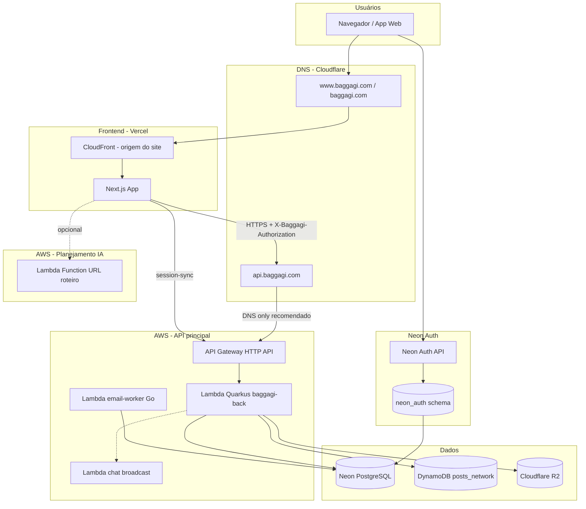
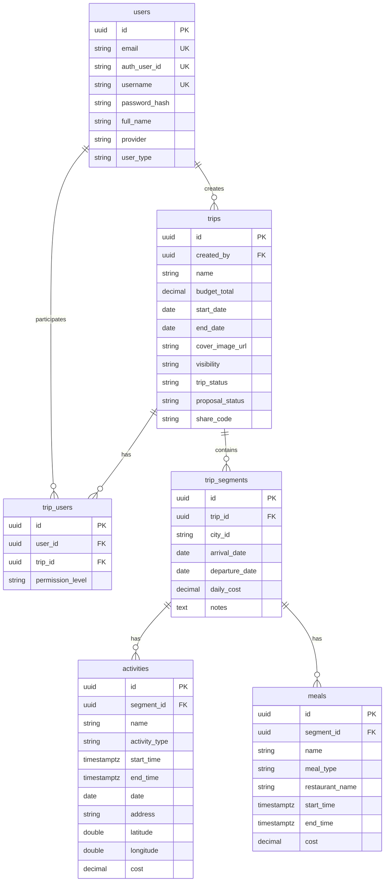
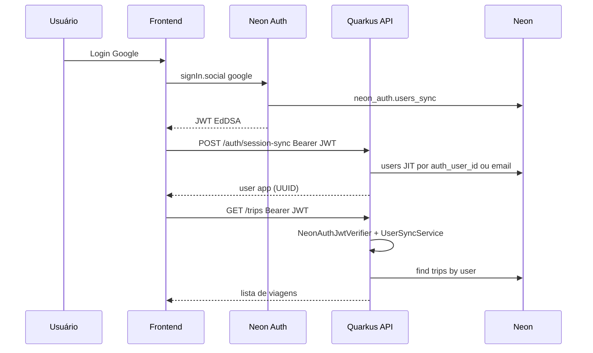

# Arquitetura completa — Baggagi (Quarkus App)

Documentação de referência do produto **planejamento de viagens**: frontend, backend, autenticação **Neon Auth**, infraestrutura AWS, DNS, banco de dados e integrações.

Documentos relacionados:

| Arquivo | Conteúdo |
|---------|----------|
| **[docs/BACKEND.md](docs/BACKEND.md)** | Referência atual do backend (domínios, APIs, integrações, decisões) |
| [DEPLOY.md](DEPLOY.md) | Deploy SAM/Lambda, erros comuns (CORS, Neon, SnapStart) |
| [docs/SES_SETUP.md](docs/SES_SETUP.md) | SES + email-worker |
| [DOCUMENTACAO.md](DOCUMENTACAO.md) | Notas antigas de código/DTOs |
| [EXEMPLO_USO.md](EXEMPLO_USO.md) | Exemplo de payload completo de viagem |
| [scripts/neon-schema-auth.sql](scripts/neon-schema-auth.sql) | SQL manual para coluna `auth_user_id` no Neon |

---

## 1. Visão do produto

O **Baggagi** permite que usuários:

- Autentiquem via **Neon Auth** (Google OAuth, e-mail, etc.) integrado ao Postgres Neon.
- Criem e editem **viagens** com orçamento, datas, imagem de capa e visibilidade.
- Organizem o roteiro em **segmentos** (cidades/períodos), com **atividades** e, opcionalmente, **refeições**.
- Compartilhem viagens (`trip_users`: `OWNER`, `ADMIN`, `VIEWER`), checklist e documentos (R2).
- Usem **chat** (trip / DM / evento), **eventos** com RSVP e **feed social** (DynamoDB).
- Assinem planos via **Stripe**; preferências de e-mail/viagem/documentos com validade.
- Em **B2B**: agências com branding, propostas interativas (tiers + link público), guests via Magic Link.

O frontend pode usar uma **Lambda de planejamento por IA** (Function URL) — fora deste repo.

Este repositório (`quarkus-app`) é o **backend principal** (API REST + persistência PostgreSQL + orquestração de integrações).

> **Referência de domínio e APIs:** [docs/BACKEND.md](docs/BACKEND.md) — prevalece sobre trechos legados deste arquivo (PKs UUID, lista completa de controllers).

---

## 2. Arquitetura de ponta a ponta


```mermaid
flowchart TB
    subgraph users [Usuários]
        Browser[Navegador / App Web]
    end

    subgraph dns [DNS - Cloudflare]
        CF_WWW[www.baggagi.com / baggagi.com]
        CF_API[api.baggagi.com]
    end

    subgraph front [Frontend - Vercel]
        Next[Next.js App]
        CF_CDN[CloudFront - origem do site]
    end

    subgraph aws_api [AWS - API principal]
        APIGW[API Gateway HTTP API]
        LambdaAPI[Lambda Quarkus baggagi-back]
        EmailWorker[Lambda email-worker Go]
        WSBroadcast[Lambda chat broadcast]
    end

    subgraph neon_auth [Neon Auth]
        AuthAPI[Neon Auth API]
        AuthSchema[(neon_auth schema)]
    end

    subgraph aws_ai [AWS - Planejamento IA]
        LambdaPlan[Lambda Function URL roteiro]
    end

    subgraph data [Dados]
        Neon[(Neon PostgreSQL)]
        Dynamo[(DynamoDB posts_network)]
        R2[(Cloudflare R2)]
    end

    Browser --> CF_WWW
    CF_WWW --> CF_CDN
    CF_CDN --> Next
    Next -->|HTTPS + X-Baggagi-Authorization| CF_API
    CF_API -->|DNS only recomendado| APIGW
    APIGW --> LambdaAPI
    LambdaAPI --> Neon
    LambdaAPI --> Dynamo
    LambdaAPI --> R2
    LambdaAPI -.-> WSBroadcast
    EmailWorker --> Neon

    Browser --> AuthAPI
    AuthAPI --> AuthSchema
    AuthSchema --> Neon
    Next -->|session-sync| APIGW
    Next -.->|opcional| LambdaPlan
```

### 2.1 Camadas de rede e segurança

| Camada | Componente | Função | Configuração atual |
|--------|------------|--------|-------------------|
| DNS | **Cloudflare** | Resolve domínios públicos | `baggagi.com`, `www` → CloudFront; `api` → API Gateway |
| CDN / Site | **CloudFront** | Entrega estática/SSR do frontend | Registros **DNS only** (nuvem cinza) |
| API | **Cloudflare** (opcional) | Proxy/WAF/CDN na API | Recomendado: **DNS only** em `api` para evitar 403/CORS extras |
| WAF | Cloudflare (se Proxied) ou AWS WAF | Filtragem | Com **DNS only** na API, WAF da Cloudflare não intercepta tráfego da API |
| API edge | **API Gateway HTTP API** | Roteamento HTTPS → Lambda | CORS configurado no template SAM + Quarkus |
| Compute | **Lambda Java 21** | Quarkus + SnapStart | Stack `baggagi-back`, alias `live` |
| Auth | **Neon Auth** | Login, JWT EdDSA, `neon_auth` schema | JWKS validado pelo backend (`NeonAuthJwtVerifier`) |
| DB | **Neon** | PostgreSQL serverless | Pooler `*.neon.tech`, SSL obrigatório |

### 2.2 URLs de produção (referência)

| Serviço | URL |
|---------|-----|
| Site | `https://baggagi.com`, `https://www.baggagi.com` |
| API backend | `https://api.baggagi.com` |
| Neon Auth | URL do projeto no console Neon → Auth (`NEON_AUTH_BASE_URL`) |
| Lambda IA (frontend) | `NEXT_PUBLIC_PLAN_LAMBDA_STREAM_URL` (Function URL separada, região `sa-east-1`) |

---

## 3. Frontend (repositório separado — Vercel)

O frontend **não está neste repositório**. Em produção costuma ser **Next.js** na **Vercel**, com variáveis como:

| Variável | Exemplo | Uso |
|----------|---------|-----|
| `NEXT_PUBLIC_API_URL` | `https://api.baggagi.com` | Chamadas REST ao Quarkus |
| `NEXT_PUBLIC_APP_URL` | `https://baggagi.com` | Links e redirects |
| `NEXT_PUBLIC_MAPBOX_ACCESS_TOKEN` | (token Mapbox) | Mapas no roteiro |
| `NEXT_PUBLIC_PLAN_LAMBDA_STREAM_URL` | `https://....lambda-url.sa-east-1.on.aws/` | Geração/stream de planejamento (Lambda **fora** deste projeto) |

### 3.1 Fluxo típico no browser

1. Usuário faz login com **Neon Auth** (ex.: Google) → recebe **JWT** (`authClient.token()`).
2. Front chama `POST /api/v1/auth/session-sync` e depois `https://api.baggagi.com` com `Authorization: Bearer <jwt>`.
3. Salva/atualiza viagem via `POST/PUT` em `/api/v1/trips/...`.
4. Opcionalmente chama a **Lambda de planejamento** para montar roteiro antes de persistir.

### 3.2 CORS

O backend aceita origens configuradas em `QUARKUS_HTTP_CORS_ORIGINS` (Lambda) / `quarkus.http.cors.origins` (local), incluindo `https://baggagi.com` e `http://localhost:3000`. Sem isso, o browser retorna **403** em requisições com header `Origin`.

---

## 4. Backend — AWS Lambda (Quarkus)

### 4.1 Stack e deploy

| Item | Valor |
|------|--------|
| Ferramenta | AWS SAM (`target/sam.jvm.yaml` gerado no `mvn package`) |
| Stack CloudFormation | `baggagi-back` (exemplo) |
| Handler | `io.quarkus.amazon.lambda.runtime.QuarkusStreamHandler` |
| Runtime | Java 21 |
| Memória / timeout | 1024 MB / 30 s |
| SnapStart | Habilitado (`ApplyOn: PublishedVersions`) |
| Perfil Quarkus | `QUARKUS_PROFILE=lambda` |

**Build e deploy:**

```bash
mvn package -DskipTests
sam deploy -t target/sam.jvm.yaml --parameter-overrides DbPassword="SENHA_NEON"
```

### 4.2 Variáveis de ambiente na Lambda (API)

| Variável | Obrigatória | Descrição |
|----------|-------------|-----------|
| `QUARKUS_PROFILE` | Sim | `lambda` — ativa `application-lambda.properties` |
| `QUARKUS_DATASOURCE_PASSWORD` | Sim | Senha Neon (`neondb_owner`) |
| `QUARKUS_DATASOURCE_JDBC_URL` | Não | Override da JDBC URL |
| `QUARKUS_HTTP_CORS_ORIGINS` | Recomendado | Lista de origens do frontend |
| `NEON_AUTH_BASE_URL` | Sim | URL base do Neon Auth (JWKS + issuer) |
| `JAVA_TOOL_OPTIONS` | Sim | `-Djava.net.preferIPv4Stack=true -Dhttps.protocols=TLSv1.2 -Djdk.tls.client.protocols=TLSv1.2` (o pin em TLS 1.2 evita `handshake_failure` da JVM ao falar com o R2 da Cloudflare — precisa ser via `JAVA_TOOL_OPTIONS`, setar via `System.setProperty` em runtime não funciona pois a JVM já cacheou o provider TLS antes) |

**Requisito de rede:** Lambda **sem VPC** (ou VPC com NAT) para alcançar Neon e JWKS do Neon Auth na internet.

### 4.3 Perfil `lambda` vs desenvolvimento local

| Config | Local (`application.properties`) | Lambda (`application-lambda.properties`) |
|--------|-----------------------------------|----------------------------------------|
| Hibernate DDL | `database.generation=update` | `none` |
| Schema | Hibernate cria/altera tabelas | **Flyway** `migrate-at-start=true` |
| MongoDB | Configurado (dev) | `quarkus.mongodb.enabled=false` |
| SQL log | `true` | `false` |

Migrações Flyway: `V1` baseline UUID … `V6` B2B/propostas (ver `src/main/resources/db/migration/`). Em prod, preferir `./scripts/db-migrate.sh` antes do deploy.

---

## 5. Autenticação e identidade

### 5.1 Neon Auth

- Serviço gerenciado no **mesmo projeto Neon** (schema `neon_auth`, tabela `users_sync`).
- **JWT:** EdDSA (Ed25519), validado por `NeonAuthJwtVerifier` via `{NEON_AUTH_BASE_URL}/.well-known/jwks.json`.
- Claims principais: `sub`, `id` (UUID), `email`, `name`, `image`.
- Google OAuth: configurar no console Neon → Auth → OAuth (pode reutilizar o OAuth Client do Google Cloud usado antes).

### 5.2 Vínculo Neon Auth ↔ `users` (aplicação)

| Campo | Descrição |
|-------|-----------|
| `users.auth_user_id` | UUID do Neon Auth (`sub` do JWT) |
| `users.id` | PK **UUID v7** da aplicação (viagens, permissões, chat) |
| `users.provider` | `google`, `neon`, etc. |
| `users.user_type` | `GUEST` \| `FREE` \| `PREMIUM` |

`UserSyncService` resolve por `auth_user_id`, depois por e-mail (mesma conta Google migrada), depois cria usuário.

### 5.3 Validação do token nas rotas protegidas

`TokenServiceImpl.validateToken()`:

1. **Neon Auth JWT** → `NeonAuthJwtVerifier` + JIT → retorna `users.id` como string.
2. **JWT legado** (login e-mail/senha local) → claim `userId` numérico.

### 5.4 Endpoints de autenticação

| Endpoint | Auth | Descrição |
|----------|------|-----------|
| `POST /api/v1/auth/session-sync` | Bearer Neon Auth JWT | Cria/vincula usuário em `users` |
| `GET /api/v1/auth/me` | Bearer JWT | Perfil do usuário autenticado |
| `POST /api/v1/auth/magic-link/request` | — | Guest B2B: solicita Magic Link |
| `POST /api/v1/auth/magic-link/verify` | — | Troca token curto por sessão |
| `POST /api/v1/users/login` | Não | Legado e-mail/senha (BCrypt + JWT local RS256) |
| `POST /api/v1/users/create-user` | Não | Registro legado |

Header preferencial nas rotas protegidas: **`X-Baggagi-Authorization: Bearer <jwt>`** (contorna JWT authorizer do API Gateway que não valida EdDSA).

---

## 6. Arquitetura de software (backend Java)

Padrão em camadas:

```text
org.example
├── controller/          # REST (JAX-RS) — /api/v1
├── application/
│   ├── dto/
│   ├── usecases/        # Create/Update Trip, user legado
│   └── services/        # chat/, event/, agency/, proposal/, …
├── domain/
│   ├── entity/          # JPA (+ chat/, event/)
│   ├── repository/      # Panache
│   └── enums/
├── infrastructure/      # Neon Auth, R2, Dynamo, filters, SnapStart
└── utils/
```

Sidecar: `services/email-worker/` (Go + SES).

### 6.1 Controllers (mapa)

| Classe | Base path | Responsabilidade |
|--------|-----------|------------------|
| `AuthController` | `/api/v1/auth` | session-sync, me, magic-link |
| `UserController` | `/api/v1/users` | login/registro, perfil, avatar |
| `TripController` | `/api/v1/trips` | CRUD viagens |
| `TripShareController` / `TripChecklistController` / `TripDocumentController` / `TripChatController` | `/api/v1/trips` | colaboração, checklist, R2, chat |
| `TripProposalController` | `/api/v1/trips` | pricing, tiers, envio de proposta |
| `PublicProposalController` | `/api/v1/public/proposals` | proposta pública |
| `AgencyController` | `/api/v1/agency` | B2B branding, team, pipeline |
| `ChatController` | `/api/v1/chat` | inbox, DMs, ws-token |
| `EventController` / `EventPostController` / `EventChatController` | `/api/v1/events` | eventos |
| `PostController` | `/api/v1/posts` | feed Dynamo |
| `PaymentController` | `/api/v1/payments` | Stripe |

Lista completa e contratos: **[docs/BACKEND.md](docs/BACKEND.md)**.

### 6.2 Casos de uso / serviços principais

| Componente | Função |
|------------|--------|
| `CreateTripUseCase` / `UpdateTripUseCase` | Aggregate de viagem (segmentos, meals, activities) |
| `UserSyncService` / `AuthSessionService` | JIT Neon Auth → `users` |
| `TripCollaborationService` | Share / permissões |
| `MessageService` / `DirectChatService` / `ChatBroadcastService` | Chat + fan-out WS |
| `EventService` / `EventPostService` | Eventos |
| `AgencyService` / `ProposalService` | B2B |
| `ObjectStorageService` | R2 |
| `PostService` | DynamoDB feed |

### 6.3 Logs

Falhas com **WARN** (negócio, 401/403/404) e **ERROR** (exceções, banco, token). Evitar INFO em fluxos de sucesso nos controllers principais.

---

## 7. Modelo de dados (PostgreSQL / Neon)

> PKs de aplicação são **UUID v7** (não `BIGINT`). Diagrama simplificado do núcleo de viagem; entidades de chat, eventos, B2B e Dynamo posts: [docs/BACKEND.md](docs/BACKEND.md).

### 7.1 Diagrama entidade-relacionamento (núcleo)


```mermaid
erDiagram
    users ||--o{ trips : creates
    users ||--o{ trip_users : participates
    trips ||--o{ trip_users : has
    trips ||--o{ trip_segments : contains
    trip_segments ||--o{ activities : has
    trip_segments ||--o{ meals : has

    users {
        uuid id PK
        string email UK
        string auth_user_id UK
        string username UK
        string password_hash
        string full_name
        string provider
        string user_type
    }

    trips {
        uuid id PK
        uuid created_by FK
        string name
        decimal budget_total
        date start_date
        date end_date
        string cover_image_url
        string visibility
        string trip_status
        string proposal_status
        string share_code
    }

    trip_users {
        uuid id PK
        uuid user_id FK
        uuid trip_id FK
        string permission_level
    }

    trip_segments {
        uuid id PK
        uuid trip_id FK
        string city_id
        date arrival_date
        date departure_date
        decimal daily_cost
        text notes
    }

    activities {
        uuid id PK
        uuid segment_id FK
        string name
        string activity_type
        timestamptz start_time
        timestamptz end_time
        date date
        string address
        double latitude
        double longitude
        decimal cost
    }

    meals {
        uuid id PK
        uuid segment_id FK
        string name
        string meal_type
        string restaurant_name
        timestamptz start_time
        timestamptz end_time
        decimal cost
    }
```

### 7.2 Status da viagem

`TripStatus` (enum) derivado de datas: `PLANNING`, `ONGOING`, `COMPLETED` — calculado em `Trip` (`@PrePersist` / `@PreUpdate`) e exposto em `TripResponseDTO`.

### 7.3 Conexão Neon

```properties
jdbc:postgresql://ep-steep-night-ai1jrfuk-pooler.c-4.us-east-1.aws.neon.tech:5432/neondb?sslmode=require&...
```

- Usuário: `neondb_owner`
- Senha: variável `QUARKUS_DATASOURCE_PASSWORD`
- Pool JDBC otimizado para Lambda (tamanho mínimo 0, validação em background)

---

## 8. API REST — referência

Base: `https://api.baggagi.com` — prefixo `/api/v1`.

Mapa completo de controllers e contratos: **[docs/BACKEND.md §6](docs/BACKEND.md)** e OpenAPI em `/q/openapi`.

### 8.1 Viagens (resumo)

| Método | Path | Descrição |
|--------|------|-----------|
| `GET` | `/trips` | Lista viagens do usuário |
| `POST` | `/trips/create-trip` | Cria viagem |
| `GET` | `/trips/{tripId}` | Detalhe |
| `PUT` | `/trips/{tripId}/update-trip` | Update completo |
| `PATCH` | `/trips/{tripId}` | Patch parcial |
| `DELETE` | `/trips/{tripId}` | Remove |
| `POST/PATCH/DELETE` | `/trips/{tripId}/share…` | Colaboração |
| CRUD | `/trips/{tripId}/checklist…` | Checklist |
| GET/POST… | `/trips/{tripId}/documents…` | Documentos R2 |

Auth: Bearer / `X-Baggagi-Authorization` + membro da viagem quando aplicável.

### 8.2 Payload de criação/atualização (`TripRequestDTO`)

Estrutura enviada pelo frontend ao salvar planejamento:

```json
{
  "name": "Londres futebol e música",
  "description": "...",
  "budgetTotal": 1800,
  "startDate": "2026-04-24",
  "endDate": "2026-04-26",
  "coverImageUrl": "https://...",
  "createdBy": "550e8400-e29b-41d4-a716-446655440000",
  "visibility": "private",
  "users": [{ "userId": "550e8400-e29b-41d4-a716-446655440000", "permissionLevel": "OWNER" }],
  "segments": [{
    "cityId": "London, United Kingdom",
    "arrivalDate": "2026-04-24",
    "departureDate": "2026-04-26",
    "notes": "...",
    "dailyCost": 600,
    "activities": [{
      "name": "...",
      "activityType": "HISTORIC",
      "date": "2026-04-24",
      "startTime": "2026-04-24T09:30:00.000Z",
      "endTime": "2026-04-24T10:30:00.000Z",
      "address": "...",
      "latitude": 51.5,
      "longitude": -0.12,
      "cost": 0
    }],
    "meals": [{
      "name": "...",
      "mealType": "breakfast",
      "description": "...",
      "restaurantName": "...",
      "address": "...",
      "latitude": 51.49,
      "longitude": -0.13,
      "date": "2026-04-24",
      "startTime": "...",
      "endTime": "...",
      "cost": 50
    }]
  }]
}
```

Validação: `TripDataValidator` — exige segmentos com ao menos uma atividade e lista `users` não vazia.

---

## 9. Lambda de planejamento (IA) — serviço separado

O frontend referencia `NEXT_PUBLIC_PLAN_LAMBDA_STREAM_URL` (ex.: Function URL em `sa-east-1`). Esse componente:

- **Não** faz parte do deploy SAM deste repositório.
- Provavelmente gera sugestões de roteiro (stream) que o frontend converte no JSON acima e envia para `POST /api/v1/trips/create-trip` ou `PUT .../update-trip`.

Trate como **microsserviço auxiliar** acoplado apenas pelo contrato JSON do frontend.

---

## 10. Evolução recente neste repositório

| Área | Itens |
|------|--------|
| **Neon Auth** | `NeonAuthJwtVerifier`, `auth_user_id`, JIT, `X-Baggagi-Authorization` |
| **Viagem** | Aggregate rico, checklist, documentos R2, share, `TripStatus` |
| **Chat / Eventos** | Postgres + broadcast WS; feature flags |
| **B2B** | Agency branding, propostas/tiers, Magic Link, auditoria |
| **Social / Pagamentos** | DynamoDB posts, Stripe |
| **E-mail** | Preferências + `email-worker` (SES) |
| **Infra** | Lambda SAM, SnapStart, Flyway V1–V6, dual JDBC pooler/direct |

Arquivos que **não** devem ir para o Git: `.m2/`, `.env`, `privateKey.pem`, `samconfig.toml`, `function.zip` (ver `.gitignore`).

---

## 11. Desenvolvimento local

### 11.1 Pré-requisitos

- Java 21, Maven 3.9+
- Docker (opcional, para Postgres/Mongo local)
- Arquivo `.env` com `QUARKUS_DATASOURCE_PASSWORD` (ver `.env.example`)

### 11.2 Subir dependências locais

```bash
docker compose up -d
```

Ajuste `application.properties` para apontar ao Postgres local se não usar Neon em dev.

### 11.3 Rodar em dev

```bash
./mvnw compile quarkus:dev
```

Dev UI: `http://localhost:8080/q/dev/`

### 11.4 Testar API local

```bash
curl http://localhost:8080/api/v1/trips/test
```

---

## 12. Diagrama de sequência — login Neon Auth + listar viagens


```mermaid
sequenceDiagram
    participant U as Usuário
    participant F as Frontend
    participant NA as Neon Auth
    participant API as Quarkus API
    participant DB as Neon

    U->>F: Login Google
    F->>NA: signIn.social google
    NA->>DB: neon_auth.users_sync
    NA-->>F: JWT EdDSA

    F->>API: POST /auth/session-sync Bearer JWT
    API->>DB: users JIT por auth_user_id ou email
    API-->>F: user app (UUID)

    F->>API: GET /trips Bearer JWT
    API->>API: NeonAuthJwtVerifier + UserSyncService
    API->>DB: find trips by user
    API-->>F: lista de viagens
```

---

## 13. Checklist de produção

- [ ] Neon Auth habilitado no projeto; Google OAuth configurado
- [ ] `NEON_AUTH_BASE_URL` na Lambda API
- [ ] Colunas `auth_user_id` / schema UUID (Flyway V1+)
- [ ] `QUARKUS_DATASOURCE_PASSWORD` correta na Lambda API
- [ ] CORS com `https://baggagi.com` e `https://www.baggagi.com`
- [ ] DNS `api` em **DNS only** (recomendado)
- [ ] Lambda API **sem VPC** bloqueando internet
- [ ] Frontend: SDK Neon Auth + `session-sync` após login
- [ ] Frontend com `NEXT_PUBLIC_API_URL=https://api.baggagi.com`

---

## 14. Troubleshooting rápido

| Sintoma | Ver |
|---------|-----|
| `403` no browser com Origin | CORS — [DEPLOY.md § Erro 403](DEPLOY.md) |
| `password authentication failed` | Senha Neon na Lambda |
| `column auth_user_id does not exist` | Flyway V7 / [scripts/neon-schema-auth.sql](scripts/neon-schema-auth.sql) |
| `Invalid token` | `NEON_AUTH_BASE_URL` + JWT válido; chamar `/auth/session-sync` |
| Lambda init failed | SnapStart + Neon + [DEPLOY.md](DEPLOY.md) |
| Token expirado (~15 min) | `authClient.token()` no frontend |

---

## 15. Contato com o código

- Domínio, APIs e decisões: **[docs/BACKEND.md](docs/BACKEND.md)** / **[README.md](README.md)**
- Deploy e operação: **[DEPLOY.md](DEPLOY.md)**
- Notas antigas de DTOs: [DOCUMENTACAO.md](DOCUMENTACAO.md) (pode estar desatualizado)
