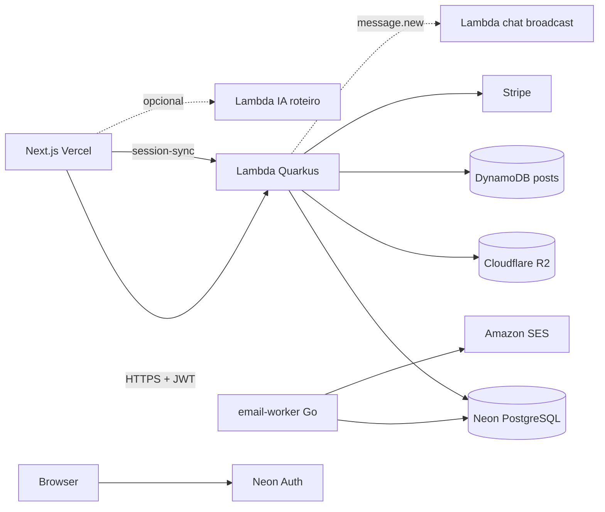

# quarkus-app — Backend Baggagi

API REST de planejamento de viagens (**Quarkus 3.24 + Java 21**), persistência em **Neon PostgreSQL**, deploy em **AWS Lambda** (`https://api.baggagi.com`).

Frontend (Next.js / Vercel) e a Lambda de planejamento por IA ficam em repositórios separados; este repo é a fonte de verdade do domínio de aplicação.

---

## O que o produto faz

| Área | Função |
|------|--------|
| **Identidade** | Neon Auth (JWT EdDSA) + `session-sync` / JIT → usuário da app (`users`, UUID v7). Login legado e Magic Link (guest B2B). |
| **Viagens** | CRUD com segmentos, atividades, refeições, orçamento, status (`PLANNING` / `ONGOING` / `COMPLETED`). |
| **Colaboração** | Share de viagem (`OWNER` / `ADMIN` / `VIEWER`), checklist, documentos (metadata + **Cloudflare R2**). |
| **Chat** | Inbox, DMs, chat de trip/evento; persistência Postgres + fan-out realtime via Lambda WS externa. |
| **Eventos** | CRUD, RSVP, invites, feed do evento, chat. |
| **Rede social** | Posts / likes / comments / feed em **DynamoDB** (`posts_network`). |
| **Pagamentos** | Stripe Checkout + webhook (FREE / PREMIUM, planos agent). |
| **Preferências** | E-mail, viagem, documentos com validade (alertas via worker). |
| **B2B / Agência** | Branding white-label, equipe, auditoria, pipeline de propostas, analytics. |
| **Propostas** | Pricing/markup, tiers, envio com `shareCode`, aprovação pública. |
| **E-mail** | Preferências na API; envio em `services/email-worker` (Go + SES). |

---

## Arquitetura (visão rápida)



| Camada | Tecnologia |
|--------|------------|
| Runtime | Java 21, Quarkus 3.24.5, RESTEasy + JSON-B |
| DB | Neon PostgreSQL + Flyway (`V1`…`V6`) |
| Auth | Neon Auth EdDSA + JWT legado RS256 |
| Deploy | AWS SAM → Lambda + API Gateway HTTP API + SnapStart |
| Storage | Cloudflare R2 (S3-compatible) |
| Social feed | DynamoDB |
| E-mail | Lambda Go + Amazon SES |
| Pagamentos | Stripe |

**Auth nas rotas:** preferir `X-Baggagi-Authorization: Bearer <jwt>` (o authorizer do API Gateway não valida EdDSA). Fallback: `Authorization` ou cookie `auth-token`.

---

## Organização do código

```
org.example
├── controller/           # JAX-RS (/api/v1/…)
├── application/
│   ├── dto/
│   ├── services/         # chat/, event/, agency/, proposal/, email/, …
│   └── usecases/         # create/update trip, user legado
├── domain/
│   ├── entity/           # (+ chat/, event/)
│   ├── repository/
│   └── enums/
├── infrastructure/       # Neon Auth, R2, Dynamo, filters, SnapStart
└── utils/

services/email-worker/    # Sidecar Go + SES (não é Quarkus)
```

Módulos novos preferem **application services** (estilo `chat/` / `event/`). Use cases existem sobretudo em trips/users legados.

---

## Mapa de APIs (`/api/v1`)

| Controller | Base | Domínio |
|------------|------|---------|
| `AuthController` | `/auth` | `session-sync`, `/me`, magic-link, neon-status |
| `UserController` | `/users` | create/login, search, perfil, avatar, países visitados |
| `ChatPrivacyController` | `/users` | privacy, chat-eligibility |
| `EmailPreferencesController` | `/users/me/email-preferences` | prefs de e-mail |
| `TravelPreferencesController` | `/users/me/travel-preferences` | prefs de viagem |
| `DocumentExpiryController` | `/users/me/documents` | passaporte/visto/etc. + alertas |
| `TripController` | `/trips` | CRUD viagem |
| `TripShareController` | `/trips` | compartilhar membros |
| `TripChecklistController` | `/trips` | checklist |
| `TripDocumentController` | `/trips` | upload/view documentos (R2) |
| `TripChatController` | `/trips` | chat da viagem |
| `TripProposalController` | `/trips` | pricing, tiers, enviar proposta |
| `TripEmailController` | `/trips/{id}/email` | e-mail pontual do roteiro |
| `PublicProposalController` | `/public/proposals` | proposta pública + approve |
| `AgencyController` | `/agency` | branding, team, audit, pipeline, analytics |
| `ChatController` | `/chat` | inbox, DMs, messages, `ws-token` |
| `EventController` | `/events` | eventos, RSVP, participants |
| `EventPostController` | `/events` | posts do evento |
| `EventChatController` | `/events` | chat do evento |
| `PostController` | `/posts` | feed Dynamo |
| `PaymentController` | `/payments` | Stripe checkout + webhook |

OpenAPI: `https://api.baggagi.com/q/openapi` (Swagger UI em `/q/swagger-ui` no runtime).

---

## Modelo de dados (núcleo)

```
User (UUID) ──┬── Trip ── TripSegment ── Activity / Meal
              │      ├── TripUser (permissões)
              │      ├── TripChecklistItem
              │      ├── TripDocument (→ R2)
              │      └── TripProposalTier
              ├── Agency / AgencyMember (B2B)
              ├── Workspace / WorkspaceMember
              ├── DocumentExpiry, UserEmailPreferences, UserTravelPreferences
              ├── Conversation / Message (chat)
              └── Event / EventParticipant / EventPost…
```

Feed social genérico: **DynamoDB**, não Hibernate.

Migrations: `src/main/resources/db/migration/` — `V1` baseline UUID, `V2` e-mail, `V3`–`V4` document expiry, `V5` travel prefs, `V6` B2B/propostas.

---

## Desenvolvimento local

**Pré-requisitos:** Java 21, Maven 3.9+, `.env` a partir de `.env.example`.

```bash
cp .env.example .env   # preencher QUARKUS_DATASOURCE_PASSWORD, Neon Auth, etc.
./mvnw compile quarkus:dev
```

- API: `http://localhost:8080`
- Dev UI: `http://localhost:8080/q/dev/`
- Health simples: `GET /api/v1/trips/test`

```bash
./mvnw package          # gera function.zip + target/sam.jvm.yaml
./mvnw test
```

---

## Deploy (resumo)

1. Migrar Neon: `./scripts/db-migrate.sh` (recomendado **antes** do deploy).
2. `mvn package -DskipTests`
3. `sam deploy -t target/sam.jvm.yaml` (stack tipicamente `baggagi-back`, perfil `QUARKUS_PROFILE=lambda`).
4. Sidecar e-mail: `cd services/email-worker && sam build && sam deploy`.

Detalhes, CORS, SnapStart e troubleshooting: **[DEPLOY.md](DEPLOY.md)**.

---

## Documentação

| Documento | Conteúdo |
|-----------|----------|
| **[docs/BACKEND.md](docs/BACKEND.md)** | Referência do backend: contextos, contratos, decisões e trade-offs |
| **[docs/ROADMAP.md](docs/ROADMAP.md)** | Plano de ajustes front + back, ordenado por impacto (B2C / B2B) |
| **[ARQUITETURA.md](ARQUITETURA.md)** | Ponta a ponta: DNS, Cloudflare, Vercel, Neon Auth, Lambdas |
| **[DEPLOY.md](DEPLOY.md)** | SAM, Secrets, variáveis, erros comuns |
| **[docs/SES_SETUP.md](docs/SES_SETUP.md)** | Amazon SES + `email-worker` |
| **[docs/AI_LAMBDA_GEMINI.md](docs/AI_LAMBDA_GEMINI.md)** | Contrato da Lambda de planejamento (fora deste repo) |
| **[docs/BACKLOG_ENTERPRISE.md](docs/BACKLOG_ENTERPRISE.md)** | Itens futuros B2B (co-browse, OCR, etc.) |
| **[EXEMPLO_USO.md](EXEMPLO_USO.md)** | Payload de exemplo de viagem |
| **[services/email-worker/README.md](services/email-worker/README.md)** | Actions SES do worker |

Em caso de conflito entre docs antigos (`DOCUMENTACAO.md`) e o código, prevalecem **`docs/BACKEND.md` e o código**.
