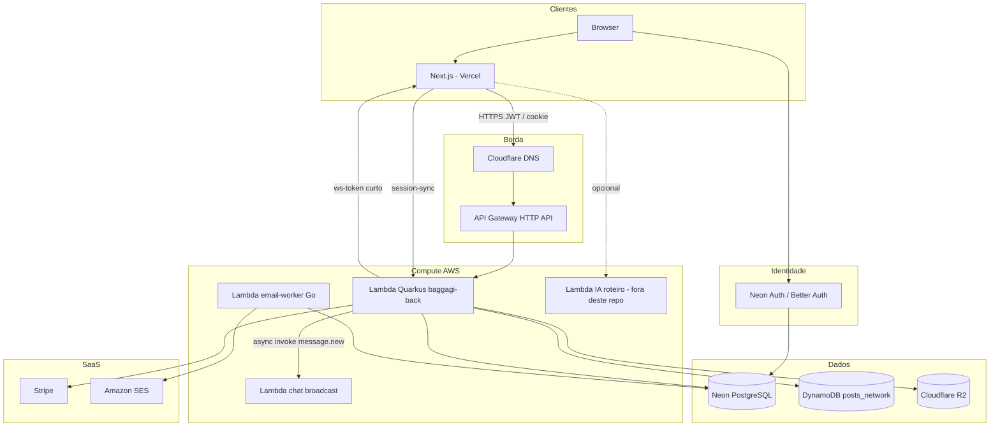
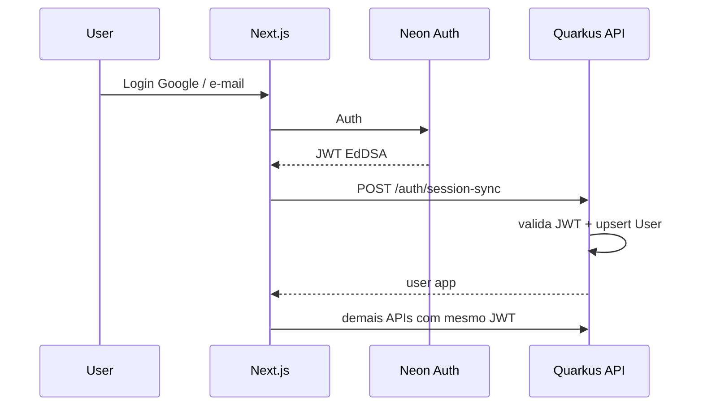

# Backend Baggagi — documentação de contexto

Documento de referência do **backend principal** (`quarkus-app`): o que faz, como está organizado, por que as escolhas foram feitas, e como se integra ao frontend e aos sistemas externos.

Use este arquivo para decisões futuras (novos módulos, trocas de infra, contratos com o front). Para deploy operacional, veja [DEPLOY.md](../DEPLOY.md). Para e-mail/SES, [SES_SETUP.md](SES_SETUP.md).

| Documento | Quando usar |
|-----------|-------------|
| **Este (`docs/BACKEND.md`)** | Entender o back, bounded contexts, contratos e trade-offs |
| [ARQUITETURA.md](../ARQUITETURA.md) | Visão ponta a ponta (DNS, Cloudflare, Vercel, Neon Auth) |
| [DEPLOY.md](../DEPLOY.md) | SAM, SnapStart, Secrets Manager, troubleshooting |
| [docs/SES_SETUP.md](SES_SETUP.md) | SES + Lambda Go `email-worker` |
| [EXEMPLO_USO.md](../EXEMPLO_USO.md) | Payload de exemplo de viagem |
| OpenAPI | `https://api.baggagi.com/q/openapi` (ou `/q/swagger-ui` em runtime) |

> **Nota:** `DOCUMENTACAO.md` e partes de `ARQUITETURA.md` podem estar desatualizadas (versão Quarkus, PKs numéricas, lista de controllers). Em conflito, **este documento e o código** prevalecem.

---

## 1. O que o backend é (e o que não é)

### Produto

**Baggagi** — API de planejamento de viagens com:

- Contas B2C (FREE / PREMIUM via Stripe)
- Colaboração em viagens (share + permissões)
- Documentos, checklist, posts sociais
- Chat (trip / DM / event) com fan-out WebSocket externo
- Eventos (RSVP, feed, chat)
- B2B (agências, guests via Magic Link, auditoria)
- Preferências de e-mail (envio feito por worker separado)

### Este repositório

| É | Não é |
|---|--------|
| API REST Quarkus em AWS Lambda | Frontend (Next.js em outro repo / Vercel) |
| Fonte de verdade do domínio de viagem, chat, eventos, users app | Neon Auth (identity provider — schema `neon_auth` gerenciado pelo Neon) |
| Persistência principal em Neon PostgreSQL | Gateway WebSocket em si (só emite token + invoca broadcast) |
| Orquestrador de Stripe checkout/webhook | Serviço de e-mail (SES) — isso é `services/email-worker` |
| Storage metadata + upload proxy R2 | Lambda de planejamento por IA (Function URL separada, chamada pelo front) |

**URLs de produção (referência):**

| Serviço | URL |
|---------|-----|
| Frontend | `https://baggagi.com` |
| API | `https://api.baggagi.com` |
| Local API | `http://localhost:8080` (`./mvnw compile quarkus:dev`) |

---

## 2. Stack e runtime

| Camada | Escolha | Motivo / consequência |
|--------|---------|------------------------|
| Language | **Java 21** | LTS; alinhado a Lambda SnapStart |
| Framework | **Quarkus 3.24.5** | Cold start / native-ready; CDI; RESTEasy |
| HTTP | RESTEasy + JSON-B + multipart | API REST; upload de docs via API |
| ORM | Hibernate ORM + **Panache** | Repositórios leves; entities = Panache |
| DB | **Neon PostgreSQL** | Serverless Postgres; Auth no mesmo projeto |
| Migrations | **Flyway** (`V1`, `V2`) | Schema versionado; baseline UUID |
| Auth JWT | Neon Auth **EdDSA** + JWT legado **RS256** | Front usa Neon; login e-mail/senha e Magic Link ainda RS256 |
| Deploy | **AWS Lambda** + API Gateway HTTP API + **SnapStart** | Serverless; `QUARKUS_PROFILE=lambda` |
| Secrets | AWS Secrets Manager `baggagi/back/<env>` | Injetados no SAM |
| Social feed | **DynamoDB** `posts_network` (sa-east-1) | Separado do Postgres de domínio |
| Files | **Cloudflare R2** (S3-compatible) | Docs de viagem + avatares |
| Payments | **Stripe** Java SDK | Checkout Session + webhook |
| E-mail | Lambda **Go** + **SES** | Desacoplado do cold path da API |
| MongoDB | Dependência presente, **desligada** na Lambda | Legado; não usar para features novas |

Arquivos de config principais:

- `src/main/resources/application.properties` — defaults + feature flags
- `application-dev.properties` — Hibernate `update`, SQL verbose
- `application-lambda.properties` — sem DDL; Flyway off no start; Mongo off
- `.env.example` — template local

---

## 3. Arquitetura em camadas (código)

```
org.example
├── controller/                 # JAX-RS — contratos HTTP
├── application/
│   ├── dto/                    # Request/Response por domínio
│   ├── exception/              # chat/, event/
│   ├── services/               # Regras de aplicação (+ chat/, event/, email/, impl/)
│   └── usecases/               # Create/Update Trip, Create/Login User (padrão mais antigo)
├── domain/
│   ├── entity/                 # JPA (+ chat/, event/)
│   ├── enums/
│   └── repository/             # Panache
├── infrastructure/
│   ├── auth/                   # NeonAuthJwtVerifier
│   ├── config/                 # SnapStart, Dynamo, Chat Lambda client
│   ├── http/                   # Filters, mappers, CookieAuthHeaderFilter
│   ├── mapper/
│   ├── repository/             # PostDynamoRepository
│   └── storage/                # ObjectStorageService (R2)
└── utils/                      # JwtAuthSupport, headers, validators
```

Sidecar no mesmo monorepo:

```
services/email-worker/          # Go + SAM + SES (não é Quarkus)
```

### Padrão de organização (escolha arquitetural)

| Padrão | Onde | Observação |
|--------|------|------------|
| **Use case** (interface + impl) | Viagens create/update, user create/login | Camada mais “clássica”; não foi estendida para chat/events |
| **Application service** | Chat, events, auth session, collaboration, posts, e-mail prefs | Preferido para módulos novos |
| **Controller fino** | Quase todos | Auth via headers; delega para service/use case |
| **Infra isolada** | Neon Auth, R2, Dynamo, Lambda invoke | Controllers não falam SDK direto (exceto Payment/Stripe no controller — legado pragmático) |

**Implicação para o futuro:** módulos novos devem seguir o estilo de `chat/` / `event/` (services + DTOs + exceptions de domínio), não necessariamente criar use-case interfaces, salvo se a equipe quiser uniformizar.

---

## 4. Visão de sistema (integrações)



### Mapa rápido: quem é dono do quê

| Responsabilidade | Dono |
|------------------|------|
| Login Google / sessão identity | Neon Auth + front |
| Usuário de aplicação (`users`, `auth_user_id`) | Quarkus (`session-sync` / JIT) |
| Viagens, checklist, share, B2B | Quarkus + Postgres |
| Arquivos binários | R2; metadata em `trip_documents` |
| Feed social genérico | DynamoDB via Quarkus |
| Chat persistido | Postgres; realtime via Lambda broadcast |
| E-mails transacionais/produto | `email-worker` + SES |
| Assinatura | Stripe + webhook Quarkus |
| Planejamento IA | Lambda externa (front) |

---

## 5. Bounded contexts

### 5.1 Identidade e usuário

**Entidade central:** `User` (PK **UUID** UUIDv7).

| Campo / conceito | Papel |
|------------------|-------|
| `auth_user_id` | `sub` do Neon Auth — vínculo identity ↔ app |
| `user_type` | `GUEST` \| `FREE` \| `PREMIUM` |
| `password_hash` | Login legado e-mail/senha |
| Perfil | nome, username, avatar, países visitados, timezone, etc. |

**Fluxo principal (produção):**

1. Front autentica no Neon Auth → recebe JWT EdDSA.
2. Front chama `POST /api/v1/auth/session-sync` com Bearer.
3. `AuthSessionService` + `UserSyncService` resolvem/criam `User` (por `auth_user_id`, depois e-mail; upgrade GUEST→FREE quando aplicável).
4. Requests seguintes usam o mesmo JWT; `TokenServiceImpl` valida Neon (JWKS) e faz JIT + cache sub→userId (~30 min).

**Auth no request:**

1. Preferir header `X-Baggagi-Authorization: Bearer <token>` (contorna JWT authorizer do API Gateway que não entende EdDSA).
2. Fallback: `Authorization: Bearer …`.
3. Cookie httpOnly `auth-token` → `CookieAuthHeaderFilter` copia para `X-Baggagi-Authorization` se não houver Bearer.

**Outros mecanismos:**

| Mecanismo | Uso |
|-----------|-----|
| `POST /users/login` + JWT RS256 | Legado local |
| Magic Link | Guest B2B: JWT curto `type=magic_link` → sessão 7d |
| `GET /chat/ws-token` | JWT RS256 curto (`typ=ws_token`, TTL ~60s) só para conectar WS |

**Workspace / Agency:**

- `Workspace` + `WorkspaceMember` — agrupamento / billing (Stripe aponta para workspace).
- `Agency` + `AgencyMember` — tenant B2B; `Trip.agency` null = B2C.
- `B2bTripLog` — auditoria de ações B2B.

---

### 5.2 Viagens (core)

Modelo:

```
Trip
 ├── TripSegment[]     # cidade / período
 │    ├── Activity[]
 │    └── Meal[]
 ├── TripUser[]         # OWNER | ADMIN | VIEWER
 ├── TripChecklistItem[]
 └── TripDocument[]    # metadata; blob no R2
```

**Serviços / use cases:** `CreateTripUseCase`, `UpdateTripUseCase`, `TripService`, `TripCollaborationService` (share).

**API (prefixo `/api/v1/trips`):**

| Método | Path | Função |
|--------|------|--------|
| GET | `/` | Listar viagens do usuário |
| POST | `/create-trip` | Criar |
| GET | `/{tripId}` | Detalhe |
| PUT | `/{tripId}/update-trip` | Update completo |
| PATCH | `/{tripId}/update-name-description` | Parcial |
| PATCH | `/{tripId}/update-users-trip` | Membros |
| DELETE | `/{tripId}` | Remover |
| POST/DELETE/PATCH | `/{tripId}/share…` | Colaboração |
| CRUD | `/{tripId}/checklist…` | Checklist |
| GET/POST… | `/{tripId}/documents…` | Documentos |
| GET/POST | `/{tripId}/chat` | Status / criar chat da trip |

**Escolha:** roteiro rico e aninhado no mesmo aggregate de viagem (não CQRS). Bom para edição colaborativa simples; atenção a payloads grandes no update.

---

### 5.3 Documentos e storage (R2)

- Metadata: `TripDocument` (status PENDING/READY, `s3_key`, etc.).
- Binários: Cloudflare R2 via `ObjectStorageService`.
- Limite upload: **10 MB** (`documents.upload.max-bytes`); body HTTP até 12M.

**Dois caminhos de upload:**

| Path | Fluxo | Preferência |
|------|-------|-------------|
| `POST …/documents/upload` | Browser → **API** → R2 (multipart) | **Preferido** — evita CORS no bucket |
| `upload-request` + `upload-confirm` | Presign PUT browser→R2 | Legado; exige CORS no R2 |

View: `view-request` → URL assinada (TTL configurável).

Avatar: `POST /api/v1/users/auth/avatar-upload-request` (mesmo storage).

---

### 5.4 Chat

**Tipos de conversa** (`ConversationType`): `TRIP`, `DIRECT`, `ACTIVITY`, `EVENT`.

**Persistência (Postgres):** `conversations`, `conversation_participants`, `messages`, `direct_conversation_pairs`, `user_privacy_settings`, `user_follows`.

**Serviços:** `MessageService`, `InboxService`, `DirectChatService`, `TripChatService`, `PrivacyService`, `ChatWsTokenService`, `ChatBroadcastService`, `ChatAuthorizationService`, `ChatRateLimiter`.

**API `/api/v1/chat`:**

| Método | Path | Função |
|--------|------|--------|
| GET | `/conversations` | Inbox |
| GET | `/conversations/{id}` | Detalhe |
| GET/POST | `/conversations/{id}/messages` | Histórico / enviar |
| POST | `/conversations/{id}/read` | Marcar lido |
| POST | `/direct` | Abrir/criar DM |
| GET | `/ws-token` | Token curto para WS |

Trip/Event chat também em:

- `GET|POST /api/v1/trips/{tripId}/chat`
- `GET|POST /api/v1/events/{id}/chat`

Privacy: `GET|PATCH /users/me/privacy`, `GET /users/{id}/chat-eligibility`.

**Realtime (escolha importante):**

1. Mensagem é persistida no Quarkus.
2. `ChatBroadcastService` faz **invoke assíncrono** (`InvocationType.EVENT`) na Lambda `CHAT_WS_BROADCAST_LAMBDA_ARN` com evento `message.new`.
3. O front obtém `ws-token` e conecta no gateway WS (fora deste processo).

Se o ARN não estiver configurado, o chat REST ainda funciona; só não há fan-out realtime.

**Feature flag:** `CHAT_ENABLED` / `chat.enabled` (+ rate limits em `chat.rate-limit.*`).

---

### 5.5 Eventos

**Entidades:** `Event`, `EventParticipant`, `EventPost`, `EventPostLike`, `EventPostComment`.

- Visibilidade / status: enums `EventVisibility`, `EventStatus`.
- Participantes: roles `ORGANIZER` / `CO_ORGANIZER` / `GUEST`; RSVP.
- Pode referenciar origem de viagem (`sourceTripId` / segment / activity).
- Feed social **do evento** fica no **Postgres** (diferente do feed global Dynamo).

**API `/api/v1/events`:** CRUD, `/public`, `/by-source`, invites, RSVP, join, participants, posts/likes/comments, chat.

**Flags:** `EVENTS_ENABLED`, limites de invites/posts, page size público.

---

### 5.6 Posts sociais (DynamoDB)

**Não** usa Hibernate. Single-table (ou modelo Dynamo) `posts_network` via `PostDynamoRepository` / `PostService`.

**API `/api/v1/posts`:** create/update/delete, likes, comments, feed, posts por autor.

**Escolha:** feed de rede separado do domínio relacional (escala/leitura diferente). Trade-off: joins com `User` do Postgres são manuais / por IDs; consistência eventual com perfil.

---

### 5.7 Pagamentos (Stripe)

`PaymentController`:

- `POST /checkout-session` — cria sessão Stripe (prices mensal/anual, inclusive agent).
- `POST /webhook` — valida assinatura; atualiza estado de assinatura (user/workspace).

Redirects: `STRIPE_SUCCESS_URL` / `STRIPE_CANCEL_URL` (front).

Não há entidade `Payment` rica no domínio — estado vive em Stripe + campos de plano no workspace/user.

---

### 5.8 E-mail

| Peça | Responsabilidade |
|------|------------------|
| Quarkus | `UserEmailPreferences` + `GET/PATCH /users/me/email-preferences` |
| Flyway V2 | `user_email_preferences`, `email_notification_log` |
| `email-worker` | Lê DB, envia SES (lembretes de trip, updates de produto); cron EventBridge 2×/dia UTC |

Detalhes operacionais: [SES_SETUP.md](SES_SETUP.md).

**Escolha:** não colocar SES no hot path da API Lambda (timeout, cold start, falhas de e-mail não derrubam a API).

---

## 6. Superfície HTTP (mapa)

Base: **`/api/v1`**.

| Controller | Base path | Domínio |
|------------|-----------|---------|
| `AuthController` | `/auth` | session-sync, me, magic-link, neon-status |
| `UserController` | `/users` | create/login, search, profile, avatar, visited-countries |
| `ChatPrivacyController` | `/users` | privacy, chat-eligibility |
| `EmailPreferencesController` | `/users/me/email-preferences` | prefs e-mail |
| `TripController` | `/trips` | CRUD viagem |
| `TripShareController` | `/trips` | share |
| `TripChecklistController` | `/trips` | checklist |
| `TripDocumentController` | `/trips` | documentos |
| `TripChatController` | `/trips` | chat da trip |
| `ChatController` | `/chat` | inbox, DMs, messages, ws-token |
| `EventController` | `/events` | eventos + RSVP |
| `EventPostController` | `/events` | feed do evento |
| `EventChatController` | `/events` | chat do evento |
| `PostController` | `/posts` | feed Dynamo |
| `PaymentController` | `/payments` | Stripe |

Filtros relevantes: rate limit chat/events, `EventsEnabledFilter`, exception mappers, CORS, cookie→header.

---

## 7. Persistência e migrations

### IDs

- PKs de aplicação: **UUID** (Hibernate `@UuidGenerator` **VERSION_7**).
- Baseline Flyway: `V1__baseline_uuid_schema.sql` (consolidação pré-lançamento; substitui a era Long/sequence).
- `V2__email_notifications.sql` — prefs + log de envio.

### Dual JDBC (escolha Neon)

| Uso | Host típico |
|-----|-------------|
| App (queries) | **Pooler** (`*-pooler.*.neon.tech`) — `QUARKUS_DATASOURCE_JDBC_URL` |
| Flyway | **Direct** (sem pooler) — `QUARKUS_FLYWAY_JDBC_URL` |

Pool JDBC na Lambda: `min/initial=0`, `max=5`, lifetimes curtos — evita conexões mortas pós-SnapStart.

### Quem aplica migrations

| Ambiente | Como |
|----------|------|
| Dev local | Flyway `migrate-at-start=true` e/ou Hibernate `update` |
| Prod recomendado | `./scripts/db-migrate.sh` **antes** do deploy |
| Lambda | `migrate-at-start=false`; `SnapStartFlywayMigrator` tenta migrate no afterRestore (janela ~10s — frágil) |

Scripts espelho manuais: `scripts/neon-schema-*.sql` (não substituem Flyway).

**Regra para o futuro:** toda mudança de schema = novo `V{n}__….sql`; nunca depender de Hibernate `update` em prod.

---

## 8. Integração com o frontend (contratos)

### 8.1 Chamadas REST

```
Origin: https://baggagi.com (ou localhost:3000)
→ https://api.baggagi.com/api/v1/...
Headers:
  X-Baggagi-Authorization: Bearer <neon-jwt>   # preferencial
  Content-Type: application/json
Credentials: include  se cookie auth-token
```

CORS no Quarkus: origins explícitas (não `*`), `access-control-allow-credentials=true`, headers incluindo `X-Baggagi-Authorization` e `Cookie`.

Env: `QUARKUS_HTTP_CORS_ORIGINS`.

### 8.2 Sequência de login (obrigatória)



Sem `session-sync`, o JWT pode ser válido no Neon e ainda assim o app não ter linha em `users` (ou `auth_user_id` desatualizado).

### 8.3 Chat realtime (contrato)

1. REST: criar/listar mensagens normalmente.
2. `GET /api/v1/chat/ws-token` com auth de sessão.
3. Conectar no WS gateway com o token curto.
4. Eventos push esperados do broadcast: tipo `message.new` + `conversationId` + payload da mensagem.

O Quarkus **não** mantém conexões WS.

### 8.4 Uploads

- Preferir multipart `…/documents/upload` pela API.
- Presign só se o front/R2 CORS estiver corretamente configurado.

### 8.5 Stripe

- Front chama `checkout-session` → redireciona para Stripe → volta em success/cancel URLs.
- Estado final vem do **webhook** (não confiar só no redirect).

### 8.6 O que o front **não** deve chamar neste repo

- Neon Auth JWKS / schema `neon_auth` diretamente para “criar user app”.
- SES / SMTP.
- DynamoDB direto.
- Lambda de broadcast (só a API invoca).
- Lambda de IA: integração front↔Function URL (documentada em ARQUITETURA), não via Quarkus.

### 8.7 DNS

Registro `api.baggagi.com` deve ser **DNS only** na Cloudflare (não proxy laranja), para evitar 403/CORS extras — ver DEPLOY.md.

---

## 9. Escolhas arquiteturais (decisões e trade-offs)

Use esta seção ao avaliar mudanças.

### D1 — API em Lambda + SnapStart (não App Runner como path principal)

- **Prós:** custo sob demanda, escala, alinhado a SAM atual.
- **Contras:** timeout 30s, body size, SnapStart + JDBC/Flyway delicados, cold paths.
- **Implica:** jobs longos (e-mail, fan-out) fora do request; migrations pré-deploy.

### D2 — Neon Auth como IdP, app user separado

- Identity ≠ domínio de aplicação.
- `session-sync` / JIT é o glue.
- API Gateway JWT authorizer **não** valida EdDSA → header custom `X-Baggagi-Authorization`.

### D3 — UUID v7 em vez de Long

- IDs opacos, ordenáveis no tempo, sem sequences compartilhadas.
- Baseline V1; docs antigos que citam `BIGINT` estão obsoletos.

### D4 — Chat: persistência sync + broadcast async

- Fonte da verdade = Postgres.
- Realtime best-effort via outra Lambda.
- Degradação graciosa se ARN ausente.

### D5 — Feed social em Dynamo; resto em Postgres

- Feed/rede com padrão de acesso diferente.
- Event posts ficam no Postgres (acoplados ao evento).
- Dois “mundos” sociais — não unificar sem motivo claro.

### D6 — Documentos via R2; upload preferencialmente pela API

- Evita CORS e credenciais no browser.
- Trade-off: tráfego passa pela Lambda (limite de tamanho / timeout).

### D7 — E-mail em worker Go + SES

- Linguagem diferente OK para sidecar simples.
- Preferências no Quarkus; envio assíncrono/agendado.

### D8 — Feature flags `chat.enabled` / `events.enabled`

- Permite desligar módulos em prod sem redeploy de código morto.
- Novos módulos sensíveis devem seguir o mesmo padrão.

### D9 — MongoDB presente mas morto

- Não reativar sem decisão explícita; na Lambda está `enabled=false`.

### D10 — Mistura UseCase vs Service

- Dívida consciente: trips/users antigos vs chat/events novos.
- Ao refatorar, padronizar em services de aplicação + mappers + exceptions tipadas.

---

## 10. Configuração (mapa mental)

### Obrigatório em prod (Secrets / env)

| Variável | Uso |
|----------|-----|
| `QUARKUS_DATASOURCE_PASSWORD` | Neon |
| `QUARKUS_DATASOURCE_JDBC_URL` | Pooler |
| `QUARKUS_FLYWAY_JDBC_URL` | Direct (migrate) |
| `NEON_AUTH_BASE_URL` / `JWKS_URL` / `ISSUER` | Validação JWT |
| `NEON_AUTH_JWK_JSON` | Opcional (cache JWK) |
| `INTERNAL_SECRET` | Rotas/interno |
| `STRIPE_*` | Pagamentos |
| `R2_*` | Storage |
| `QUARKUS_HTTP_CORS_ORIGINS` | Front |
| `CHAT_WS_BROADCAST_LAMBDA_ARN` | Realtime chat |
| `AWS_DYNAMODB_*` | Posts (IAM na Lambda) |

### Feature flags úteis

| Flag | Default |
|------|---------|
| `CHAT_ENABLED` | true |
| `EVENTS_ENABLED` | true |
| Rate limits chat/events | ver `application.properties` |

Lista completa de template local: `.env.example`.

---

## 11. Deploy (resumo)

1. Migrar: `./scripts/db-migrate.sh` (ou `./scripts/deploy.sh`).
2. Package: `mvn package -DskipTests` → `function.zip` + `target/sam.jvm.yaml`.
3. `sam deploy` (stack tipicamente `baggagi-back`).
4. Profile Lambda: `QUARKUS_PROFILE=lambda`.
5. Sidecar e-mail: `cd services/email-worker && sam build && sam deploy`.

Detalhes, CORS, SnapStart, Neon Auth 401: **[DEPLOY.md](../DEPLOY.md)**.

CI: `.github/workflows/deploy.yml`.

---

## 12. Como usar este doc nas próximas decisões

Checklist rápido antes de implementar algo novo:

1. **É domínio de viagem/user/chat/event?** → Postgres + entity + Flyway `Vn` + service em `application/services/…`.
2. **É feed/rede de alto volume com acesso chave-valor?** → Avaliar Dynamo (padrão posts) vs Postgres.
3. **Precisa de arquivo?** → R2 + metadata; preferir proxy pela API se o browser for o cliente.
4. **Precisa de realtime?** → Persistir na API + broadcast Lambda; token curto dedicado; não abrir WS no Quarkus.
5. **Precisa de e-mail / cron / batch?** → Worker (`email-worker` ou novo sidecar), não no request path.
6. **Precisa de identity?** → Neon Auth no front; app só `session-sync` + claims.
7. **Contrato com o front:** path sob `/api/v1`, auth via `X-Baggagi-Authorization`, CORS com credentials, DTO estável, OpenAPI.
8. **Feature arriscada?** → flag `*.enabled` + rate limit filter, como chat/events.
9. **Schema:** nunca Hibernate `update` em prod; dual URL pooler/direct; testar migrate no Neon dev primeiro.
10. **Docs legados:** se `ARQUITETURA.md` / `DOCUMENTACAO.md` contradisserem o código ou este arquivo, atualize aqueles ou ignore o trecho velho.

---

## 13. Índice de classes-chave

| Área | Classes |
|------|---------|
| Auth | `NeonAuthJwtVerifier`, `AuthSessionService`, `UserSyncService`, `TokenServiceImpl`, `MagicLinkService`, `CookieAuthHeaderFilter`, `RequestAuthHeaders` |
| Trips | `CreateTripUseCaseimpl`, `UpdateTripUseCaseImpl`, `TripServiceImpl`, `TripCollaborationService` |
| Chat | `MessageService`, `DirectChatService`, `InboxService`, `ChatWsTokenService`, `ChatBroadcastService`, `PrivacyService` |
| Events | `EventService`, `EventParticipantService`, `EventPostService`, `EventChatService` |
| Storage | `ObjectStorageService` |
| Posts | `PostService`, `PostDynamoRepository` |
| E-mail prefs | `EmailPreferencesService` |
| Infra Lambda | `SnapStartFlywayMigrator` |

---

*Última atualização alinhada ao código em Jul/2026 (Quarkus 3.24.5, Flyway V1+V2 UUID, módulos chat/events/email-worker).*
