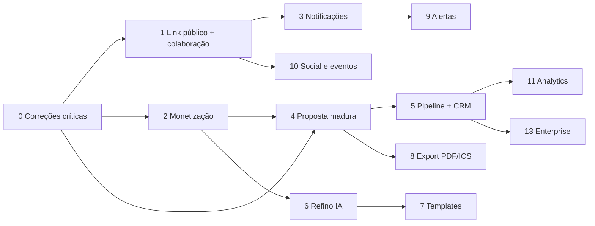

# Roadmap de ajustes — Baggagi (backend + frontend)

Plano único de execução, unificando as lacunas vistas no **backend** (`quarkus-app`) e no **frontend** (Next.js). Cada épico traz o trabalho dos dois lados junto, porque na prática são a mesma entrega.

Regra que orienta a ordem: **B2C precisa compartilhar e voltar; B2B precisa fechar negócio.** Feed, dashboards e demos sem ação no funil ficam para depois.

| Legenda | Significado |
|---------|-------------|
| **B2C** / **B2B** / **Ambos** | Público impactado |
| Esforço **P / M / G** | ≤3 dias / ~1–2 semanas / 3+ semanas |
| DoD | Definition of Done — critério objetivo de pronto |

---

## Ordem de execução (visão geral)

| # | Épico | Lado | Esforço | Por que agora |
|---|-------|------|---------|---------------|
| **0** | [Correções críticas de contrato](#épico-0--correções-críticas-de-contrato) | Ambos | P | Fluxos que cobram ou prometem e não entregam |
| **1** | [Link público e colaboração na viagem](#épico-1--link-público-e-colaboração-na-viagem) | Ambos | G | Sem compartilhar, o produto não circula |
| **2** | [Monetização: entitlements, paywall e pagamento da proposta](#épico-2--monetização-entitlements-paywall-e-pagamento-da-proposta) | Ambos | G | Receita B2C e fechamento da venda B2B |
| **3** | [Central de notificações](#épico-3--central-de-notificações) | Ambos | M | Retenção; hoje só existe e-mail |
| **4** | [Proposta B2B madura](#épico-4--proposta-b2b-madura) | B2B | M | Aceite, recusa, validade e trilha jurídica |
| **5** | [Pipeline unificado + CRM leve](#épico-5--pipeline-unificado--crm-leve) | B2B | G | Operação diária do consultor |
| **6** | [Refino da IA pós-geração](#épico-6--refino-da-ia-pós-geração) | Ambos | M | O valor está no ajuste, não no primeiro plano |
| **7** | [Templates e reuso de roteiro](#épico-7--templates-e-reuso-de-roteiro) | Ambos | M | Recorrência B2C e escala B2B |
| **8** | [Export: PDF, ICS e pacote offline](#épico-8--export-pdf-ics-e-pacote-offline) | Ambos | M | Entregável tangível dos dois lados |
| **9** | [Alertas de viagem empacotados](#épico-9--alertas-de-viagem-empacotados) | B2C | P | Infra pronta, falta produto |
| **10** | [Social e eventos com propósito](#épico-10--social-e-eventos-com-propósito) | B2C | G | Loop de descoberta |
| **11** | [Analytics acionáveis](#épico-11--analytics-acionáveis) | B2B | M | Depende de histórico de status |
| **12** | [Dívida técnica transversal](#épico-12--dívida-técnica-transversal) | Ambos | M | Contínuo, não bloqueia os demais |
| **13** | [Backlog enterprise](#épico-13--backlog-enterprise-somente-com-gono-go) | B2B | G | Só com go/no-go |

---

## Épico 0 — Correções críticas de contrato

**Ambos · Esforço P · Sem dependências — começar por aqui.**

São defeitos pequenos, porém de alto risco: um cobra sem entregar, outro quebra o fluxo de guest, outro registra auditoria errada.

### 0.1 Pagamento `UNITARIO` não entrega nada

Hoje o webhook apenas loga:

```402:404:src/main/java/org/example/controller/PaymentController.java
        } else if ("UNITARIO".equals(paymentType)) {
            log.info("Single trip payment verified for Trip ID: {}", targetId);
        }
```

- **Backend:** criar tabela `trip_unlocks` (`trip_id`, `user_id`, `kind`, `amount`, `stripe_session_id`, `paid_at`) e liberar o benefício (export, IA, storage) para aquela viagem. Definir com produto o que exatamente o R$ 49,90 compra.
- **Frontend:** tela de sucesso lê o desbloqueio real (`GET /trips/{id}` com flag `unlocked`), não só o redirect do Stripe.
- **DoD:** pagar `UNITARIO` em modo teste libera o benefício e sobrevive a refresh e a novo login.

### 0.2 Magic Link não envia e-mail

```178:179:src/main/java/org/example/controller/AuthController.java
            // Envio de e-mail: Lambda Go (email-worker). Em dev, log do token.
            log.info("[MAGIC_LINK_DEV] token para email={} tripId={}: {}", body.getEmail(), body.getTripId(), token);
```

- **Backend:** generalizar `EmailWorkerInvoker` (hoje só monta `action=send_direct`) para aceitar qualquer action, e disparar o link de acesso. Manter resposta 200 genérica para não permitir enumeração de e-mail.
- **Frontend:** página de "verifique seu e-mail" e rota de verificação que consome `POST /auth/magic-link/verify`.
- **DoD:** guest recebe e-mail, clica e cai autenticado na viagem, sem log de token em produção.

### 0.3 Proposta enviada não avisa o cliente

`ProposalService.sendProposal` muda status e grava auditoria, mas não notifica ninguém — enquanto o worker já suporta `send_white_label`.

- **Backend:** ao enviar, invocar `send_white_label` (`templateKind=proposal_sent`) com `agencyId`, `tripName` e `shareUrl`.
- **Frontend:** feedback de "proposta enviada para X" com data/hora e opção de reenviar.
- **DoD:** `POST /trips/{id}/proposal/send` gera e-mail branded e registra o envio.

### 0.4 Aprovação pública registra o ator errado

Em `approvePublicProposal`, a auditoria usa `trip.getCreatedBy()` — ou seja, o consultor aparece aprovando a própria proposta.

- **Backend:** registrar ator como cliente (`actor=null` + `actorLabel`/e-mail do guest) e evoluir junto com o épico 4 (aceite digital).
- **DoD:** trilha de auditoria distingue ação do consultor e ação do cliente.

### 0.5 Nomes de permissão divergentes

O OpenAPI de `TripShareController` documenta `READ, EDIT, MANAGE`, mas o enum real é `OWNER, ADMIN, VIEWER` (`UserPermissionLevel`).

- **Backend:** corrigir descrições e padronizar o vocabulário exposto.
- **Frontend:** usar exatamente os valores do enum nos selects.
- **DoD:** OpenAPI, front e enum falam a mesma língua.

### 0.6 Webhook Stripe sem idempotência

Não há dedupe por `event.id`; um retry do Stripe reprocessa o upgrade.

- **Backend:** tabela `stripe_events` (`event_id` UK) verificada antes de processar.
- **DoD:** reenviar o mesmo evento não duplica efeito.

---

## Épico 1 — Link público e colaboração na viagem

**Ambos · Esforço G · Depende de 0.5 · Status: implementado (2026-07-25)**

Hoje só a **proposta** tem link público (`/p/{shareCode}`). A viagem em si exige login e vínculo em `trip_users`, e o compartilhamento por e-mail só funciona se a pessoa **já** tem conta (`TripCollaborationService.resolveInvitee` busca `findByEmail` e falha se não achar). Isso mata o "manda pro amigo" no B2C e o portal do cliente no B2B.

### 1.1 Link de leitura pública da viagem

- **Backend:** nova entidade `TripShareLink` (`trip_id`, `code` UK, `scope=VIEW_ONLY`, `expires_at`, `revoked_at`, `created_by`). Não reaproveitar `trips.share_code`, que já é do funil de proposta.
  - `POST /api/v1/trips/{tripId}/share-links` — cria/rotaciona
  - `GET /api/v1/trips/{tripId}/share-links` · `DELETE .../{linkId}` — revogar
  - `GET /api/v1/public/trips/{code}` — payload reduzido, sem docs privados, sem dados de outros membros
  - Rate limit no endpoint público, no mesmo padrão de `EventsRateLimitFilter`
- **Frontend:** rota pública `/t/[code]` fora do middleware protegido, OG image decente, botão de WhatsApp, CTA "criar minha versão desta viagem".
- **DoD:** link aberto em aba anônima renderiza o roteiro; revogar derruba o acesso na hora.

### 1.2 Convite por e-mail para quem ainda não tem conta

- **Backend:** entidade `TripInvite` (`trip_id`, `email`, `permission_level`, `token`, `status`, `invited_by`, `expires_at`).
  - `POST /api/v1/trips/{tripId}/invites` — cria convite + dispara e-mail pelo worker
  - `POST /api/v1/trips/invites/{token}/accept` — vincula ao usuário após login/cadastro
  - `GET`/`DELETE` para listar e revogar pendentes
- **Frontend:** modal de compartilhamento com estados **pendente / aceito / expirado** e reenvio.
- **DoD:** convidar um e-mail sem conta gera convite pendente que vira `TripUser` no primeiro login.

### 1.3 Comentários no dia e na atividade

- **Backend:** entidade `TripComment` (`trip_id`, `target_type` = `TRIP|SEGMENT|DAY|ACTIVITY|MEAL`, `target_id`, `author_id`, `body`, `resolved_at`), CRUD em `/api/v1/trips/{tripId}/comments`, permissão mínima `VIEWER` para ler e comentar, `ADMIN` para resolver.
- **Frontend:** thread lateral no dia/atividade e badge de não lidos.
- **Integração:** cada comentário emite notificação (épico 3) e serve também ao portal do cliente B2B.
- **DoD:** comentar avisa os demais membros e o contador de não lidos zera ao abrir.

---

## Épico 2 — Monetização: entitlements, paywall e pagamento da proposta

**Ambos · Esforço G · Depende de 0.1 e 0.6 · Status: implementado (2026-07-26)**

O Stripe existe, mas não há **limite** aplicado no B2C nem **cobrança** ligada à proposta aprovada no B2B.

### 2.1 Serviço de entitlements (fonte única de limites)

- **Backend:** `EntitlementService` derivando de `UserType` + `Workspace.planType` + `trip_unlocks`. Limites sugeridos: viagens ativas, gerações de IA/mês, MB de documentos, export PDF, nº de share links.
  - `GET /api/v1/me/entitlements` — o front renderiza o paywall a partir daqui, sem regra duplicada
  - Enforcement real nos pontos de escrita: criar viagem, upload de documento, export, chamada de IA
  - Tabela `ai_generations` para contar consumo por período
- **Frontend:** paywall consistente (limite atingido → tela de upgrade), estados de sucesso/cancelamento do Stripe ligados ao entitlement real.
- **DoD:** usuário FREE bate no limite e vê upgrade; após pagar, o limite muda sem novo login.

### 2.2 Pagamento amarrado à proposta aprovada (B2B)

- **Backend:** tabela `trip_payments` (`trip_id`, `kind` = `DEPOSIT|BALANCE`, `amount`, `currency`, `stripe_session_id`, `status`) e estados de venda além de `APPROVED` — sugerido `PENDING_PAYMENT` e `CONFIRMED` em `ProposalStatus`.
  - `POST /api/v1/public/proposals/{shareCode}/checkout` — sinal ou valor cheio
  - Webhook atualiza `trip_payments` e promove a proposta
  - Registrar `baseCost`, `finalPrice` e **margem** no card do pipeline
- **Frontend:** CTA de pagamento na proposta pública; no pipeline, card mostra valor, markup e margem.
- **DoD:** cliente aprova, paga o sinal e o card entra em `CONFIRMED` com valor registrado.

---

## Épico 3 — Central de notificações

**Ambos · Esforço M · Depende de 1.3 para os eventos de comentário · Status: implementado (2026-07-26)**

Hoje não existe nenhuma notificação in-app — apenas e-mail via worker. Uma única infra atende os dois públicos.

- **Backend:** entidade `Notification` (`user_id`, `kind`, `title`, `body`, `entity_type`, `entity_id`, `read_at`) e `NotificationService` central.
  - `GET /api/v1/notifications` (paginado, filtro não lidas) · `POST /api/v1/notifications/read`
  - Kinds iniciais: `TRIP_SHARED`, `TRIP_COMMENT`, `CHAT_MESSAGE`, `EVENT_RSVP`, `DOC_EXPIRING`, `PROPOSAL_SENT`, `PROPOSAL_APPROVED`, `PAYMENT_CONFIRMED`
  - Realtime reaproveitando `ChatBroadcastService`; e-mail respeitando `UserEmailPreferences`; push (FCM/APNs) fica para depois
- **Frontend:** sino com contador, drawer da lista, deep link para o objeto, preferências por canal.
- **DoD:** comentar, aprovar proposta e receber mensagem geram notificação in-app coerente com as preferências de e-mail.

---

## Épico 4 — Proposta B2B madura

**B2B · Esforço M · Depende de 0.3, 0.4 e 2.2 · Status: implementado (2026-07-26)**

O esqueleto existe (pricing, tiers, `shareCode`, aprovação). Falta o que dá segurança jurídica e fecha venda.

- **Backend:**
  - **Validade:** `proposal_expires_at`; proposta expirada não aceita aprovação
  - **Recusa pública:** `POST /public/proposals/{code}/reject` com motivo → `REJECTED` + auditoria (hoje só existe approve)
  - **Aceite digital:** tabela `proposal_acceptances` (`trip_id`, `name`, `email`, `ip`, `user_agent`, `accepted_at`, `tier_code`) — o aceite precisa dizer **quem** aceitou e **qual tier**
  - **Tiers no aceite:** hoje o tier escolhido não é registrado na aprovação
  - **CTA WhatsApp:** `Agency.whatsappNumber` já existe; expor no payload público
- **Frontend:** página `/p/[shareCode]` com tiers comparáveis, validade visível, aceite com nome/e-mail, recusa com motivo, botões de WhatsApp e pagamento.
- **DoD:** cliente escolhe tier, aceita identificando-se, e a agência vê nome, horário, IP e tier na trilha de auditoria.

---

## Épico 5 — Pipeline unificado + CRM leve

**B2B · Esforço G · Depende de 4 · Status: implementado (2026-07-26)**

A API de pipeline e analytics existe; a `/business` no front ainda é protótipo com estado local. E não há **cliente** como entidade — só viagens soltas.

### 5.1 Pipeline ponta a ponta

- **Backend:** filtros e paginação em `GET /agency/pipeline` (`?status=&consultantId=&q=&page=`); agregação no repositório em vez de varrer todas as viagens em memória (`ProposalService.listPipeline` / `analytics` carregam `findByAgencyId` inteiro).
- **Frontend:** Kanban real com drag-and-drop persistindo via `PATCH /trips/{id}/proposal/status`; nada de estado só na tela.
- **DoD:** mover card persiste, sobrevive a refresh e aparece na auditoria.

### 5.2 CRM: ficha do cliente

- **Backend:** entidade `AgencyClient` (`agency_id`, `name`, `email`, `phone`, `notes`, `tags`, `user_id` nullable) e `trips.client_id`. Ficha agrega viagens, propostas, documentos e preferências.
- **Frontend:** lista de clientes e ficha 360 com histórico e notas.
- **DoD:** consultor abre um cliente e vê todas as propostas e viagens dele.

### 5.3 Time e atribuição

- **Backend:** `trips.assigned_consultant_id` + filtro "minhas viagens" (hoje `AgencyRole` só distingue OWNER de CONSULTANT, e o consultor vê apenas o que criou); convite de membro com **pendência** (hoje `inviteMember` exige usuário já existente, mesmo problema do 1.2).
- **Frontend:** filtro por consultor, reatribuição e timeline de auditoria visível.
- **DoD:** owner reatribui uma viagem e o consultor certo passa a vê-la.

---

## Épico 6 — Refino da IA pós-geração

**Ambos · Esforço M · Depende de 2.1 para contagem de créditos**

A geração vive numa Lambda externa ([docs/AI_LAMBDA_GEMINI.md](AI_LAMBDA_GEMINI.md)). O ganho agora é **refinar** o plano existente.

- **Lambda IA:** ações `regenerateDay` / `refineSegment` com intenções — "mais barato", "mais local", "menos corrido", trocar atividade.
- **Backend:** endpoint de aplicação parcial e atômica (ex.: `PUT /trips/{id}/segments/{segmentId}`) para não reenviar o aggregate inteiro; log em `ai_generations`; roteamento de modelo por plano (Flash para FREE, Pro para PREMIUM/B2B) validado no servidor, não no front.
- **Frontend:** ações contextuais no dia e na atividade, com preview e desfazer.
- **DoD:** refinar um dia altera só aquele dia, consome crédito e pode ser desfeito.

---

## Épico 7 — Templates e reuso de roteiro

**Ambos · Esforço M · Depende de 6**

Mesma mecânica serve ao "viajar de novo" (B2C) e à biblioteca da agência (B2B).

- **Backend:** `trip_templates` (`scope` = `PERSONAL|AGENCY`, `owner_id`/`agency_id`, `name`, `payload` JSONB), `POST /trips/{id}/save-as-template`, `POST /trips/from-template/{templateId}`. Blocos reutilizáveis (transfer, hotel parceiro) como template parcial de segmento.
- **Frontend:** galeria de templates em `/create`, e as `UserTravelPreferences` (já sincronizadas) pré-preenchendo o formulário de ponta a ponta.
- **DoD:** criar viagem a partir de template leva menos de um minuto e respeita as preferências salvas.

---

## Épico 8 — Export: PDF, ICS e pacote offline

**Ambos · Esforço M · Depende de 4 para a versão branded**

- **Backend:**
  - **ICS** direto no Quarkus (barato): `GET /trips/{id}/calendar.ics` com token assinado
  - **PDF** fora do request path — worker dedicado gerando HTML→PDF e salvando no R2; API expõe job + URL assinada. Lambda de 30s e limite de body não comportam geração síncrona
  - Duas variantes: roteiro do viajante (B2C) e proposta branded da agência (B2B)
- **Frontend:** botão de export com estado assíncrono; pacote offline/PWA leve (dia atual + documentos essenciais).
- **DoD:** viajante baixa PDF e importa o ICS no calendário; agência baixa a proposta com logo e cor.

---

## Épico 9 — Alertas de viagem empacotados

**B2C · Esforço P · Depende de 3**

A infra já existe (`DocumentExpiry`, `UserEmailPreferences`, crons do `email-worker`); falta virar produto.

- **Backend:** consolidar as regras de disparo — validade de passaporte/visto (D-180/D-90/D-30), checklist pré-voo (D-7/D-1), lembretes de pagamento e reserva — reaproveitando `document_expiry_reminders` e `trip_reminders`.
- **Frontend:** "central de alertas da viagem" com o que está pendente e o que já foi resolvido.
- **DoD:** passaporte vencendo gera e-mail **e** notificação in-app, respeitando as preferências.

---

## Épico 10 — Social e eventos com propósito

**B2C · Esforço G · Depende de 1**

Posts, follows e eventos existem, mas o loop é genérico demais.

- **Backend:** `POST /posts/from-trip-day` (publicar um dia do roteiro), `POST /trips/{id}/import-from-post/{postId}` (copiar trecho para a minha viagem), descoberta por destino (GSI no DynamoDB ou índice no Postgres), ICS de evento e remoção do estado "beta" do módulo (hoje atrás de `EVENTS_ENABLED`).
- **Frontend:** feed por destino, ação de copiar trecho e fluxo completo atividade → evento → RSVP → chat → pós-evento.
- **DoD:** copiar um dia de outro viajante cria segmento na minha viagem em um clique.

---

## Épico 11 — Analytics acionáveis

**B2B · Esforço M · Depende de 5 — precisa de histórico**

O analytics atual conta status e soma `finalPrice` em memória. Métricas de tempo exigem histórico que **ainda não é gravado**.

- **Backend:** tabela `proposal_status_history` (`trip_id`, `from`, `to`, `actor`, `changed_at`) alimentada em toda transição; agregações em SQL: funil por consultor, tempo médio até aceite, destinos que mais fecham, margem média; export CSV.
- **Frontend:** dashboard com filtro de período e consultor, e botão de export.
- **DoD:** owner responde "quanto tempo leva para fechar e quem fecha mais" sem planilha.

---

## Épico 12 — Dívida técnica transversal

**Ambos · Esforço M · Contínuo, em paralelo aos demais**

| Item | Situação | Ação |
|------|----------|------|
| **Testes automatizados** | Praticamente inexistentes (só `GreetingResourceTest`) | Cobrir primeiro o que envolve dinheiro e acesso: webhook, entitlements, permissões de trip, proposta pública |
| **Endpoints públicos** | `/public/proposals/**` sem rate limit | Filtro no padrão de `EventsRateLimitFilter` + entropia adequada do `shareCode` |
| **Agregações em memória** | `listPipeline` / `analytics` carregam todas as viagens da agência | Migrar para consulta agregada |
| **UseCase vs Service** | Dívida consciente (trips/users antigos vs chat/events) | Padronizar em application services ao tocar cada módulo |
| **MongoDB** | Dependência morta, desligada na Lambda | Remover quando não houver risco |
| **Migrations em prod** | `SnapStartFlywayMigrator` tenta migrar no afterRestore (janela frágil) | Padronizar `scripts/db-migrate.sh` antes do deploy no CI |
| **Docs** | `DOCUMENTACAO.md` legado | Manter `docs/BACKEND.md` como fonte única |

---

## Épico 13 — Backlog enterprise (somente com go/no-go)

**B2B · Esforço G · Não iniciar antes dos épicos 1–5**

Detalhes e contratos em [docs/BACKLOG_ENTERPRISE.md](BACKLOG_ENTERPRISE.md):

- Co-browsing em tempo real (reaproveita o WS do chat)
- Coletor de documentos por OCR/WhatsApp
- Agente guardião de voos + reacomodação com humano no loop
- Stripe Connect (split operadora/agência/agente) — depende de KYC e modelo de fee
- Multi-agência e white-label de domínio próprio

---

## Dependências entre épicos



---

## Sugestão de fatiamento por ciclo

| Ciclo | Entrega | Resultado esperado |
|-------|---------|--------------------|
| **1** | Épico 0 completo + 1.1 (link público) | Nada cobra sem entregar; viagem circula por link |
| **2** | 1.2 e 1.3 (convite + comentários) + épico 3 | Viagem vira espaço colaborativo com avisos |
| **3** | Épico 2 (entitlements + pagamento da proposta) | Receita B2C aplicada e venda B2B fechável |
| **4** | Épico 4 + 5.1 | Proposta com aceite jurídico e pipeline real |
| **5** | 5.2, 5.3 e épico 6 | CRM leve e refino de IA |
| **6+** | Épicos 7 a 11 | Reuso, export, alertas, social e analytics |

Épico 12 corre em paralelo desde o ciclo 1, priorizando testes de pagamento e permissão.
